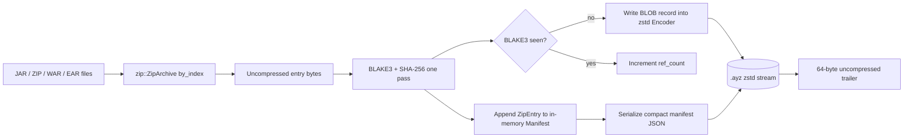
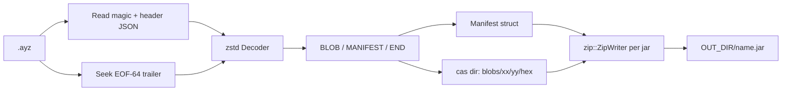
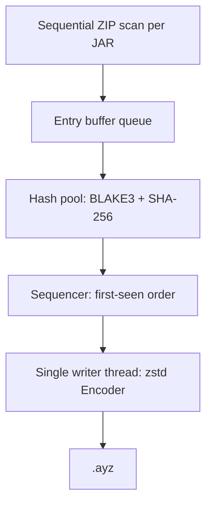

# Design: ayzenpack — JAR dehydrate / rehydrate CLI

| Field | Value |
|-------|--------|
| **Title** | ayzenpack v1 implementation contract |
| **Author** | ayzenpack contributors |
| **Date** | 2026-08-25 |
| **Status** | Draft |
| **Workspace** | `/home/brewerm/git/ayzenpack` |
| **Origin** | `github.com__hilather__ayzenpack` (`github.com/hilather/ayzenpack`) |
| **Audience** | Implementing engineers / agents |
| **MSRV** | Rust 1.80 (edition 2021, stable only) |
| **License (crate)** | Apache-2.0 OR MIT |
| **Spec pack (reference)** | `/home/brewerm/Downloads/jded-design-pack` |

This document is the **implementation contract** for the greenfield `ayzenpack` repository. An engineer should be able to implement v1 from this file alone. The original design pack named the tool `jded`; this product is **ayzenpack**. Algorithms, record types, hashing, and reconstruction semantics are preserved from the pack. Product identity (binary, crate, magic, extension, header/manifest discriminator strings, help text) is `ayzenpack` throughout. See **Key Decisions**.

---

## Overview

A set of JARs (fat JARs, `BOOT-INF/lib`, plugin folders, `userlib`) often repeats the same `.class` and resource bytes tens or hundreds of times. `ayzenpack` is a high-performance Rust CLI that **dehydrates** many JAR/ZIP files into **one** Zstd-compressed content-addressed archive, storing each unique uncompressed ZIP entry once, plus an embedded JSON manifest that can rebuild each original JAR filename. **Rehydrate** reads that archive and writes the JARs back.

Dedup key is **BLAKE3** of uncompressed entry bytes. **SHA-256** of the same bytes is recorded on every blob and every file entry for integrity and interoperability, never used as the CAS key. The container is a single file: uncompressed file header, one zstd frame of length-prefixed records (BLOB / MANIFEST / END), uncompressed 64-byte trailer. v1 reconstruction is **functional identity** of uncompressed entries, names, central-directory order, and CRC-32 — not bit-identity of the ZIP container.

The tool never unpacks JARs to a forest of `.class` files, never talks to the network, and contains no `unsafe`. Correctness and round-trip tests land before rayon/progress polish. Performance is designed in from day one (streaming, single zstd frame, I/O buffering, memory bounds, one-pass dual hash) so later parallelism does not require a format change.

---

## Background & Motivation

### Current state

There is no crate in this repository. The workspace is empty (no commits). The source of truth for format and algorithms is the `jded` design pack. That pack forbids changing magic (`JDED` + version `0x01`) and the `.jded` extension; the product we are shipping is named **ayzenpack**, so this document makes a single coherent identity swap (magic, trailer magic, extension, header `format`/`tool`, manifest `format` discriminator, CLI, crate) and leaves record layout, field names, and algorithms alone.

### Pain points this solves

1. Shipping or caching N application classpaths duplicates Guava/Netty/Jackson/Log4j class files on disk.
2. `tar`/`zip` of a lib directory does not content-dedup across archives.
3. Exploding JARs to a class forest, then tar-ing, is slow, huge on disk, and loses ZIP metadata (order, DOS time, CRC).
4. Existing content-addressed stores (git, ostree) are the wrong granularity and do not rebuild JARs.

### Why this shape

Storing **uncompressed** entry bytes into **one zstd frame** usually beats concatenating already-deflated ZIP members: deflate is not a concatenable input for a second compressor. Identical class files across JARs collapse to one BLOB. The manifest is inside the archive so rehydrate is one file in, N JARs out.

---

## Goals & Non-Goals

### Goals (v1)

- Dehydrate one or more `.jar` / `.zip` / `.war` / `.ear` files into a single `.ayz` archive.
- Rehydrate that archive into the original JAR **basenames** (disambiguated on collision).
- Dedup by BLAKE3(uncompressed entry bytes). Directories have no blob.
- Record SHA-256 on every blob and every file entry.
- Preserve ZIP entry names, central-directory order, DOS date/time, CRC-32, uncompressed size.
- Stream ZIP entries via the `zip` crate (`Read + Seek`). Peak memory ≈ largest entry + zstd buffer + in-memory manifest + seen-hash set.
- `list` and `verify` subcommands.
- Library API (`dehydrate`, `rehydrate`, `list`, `verify`) usable without clap.
- Linux and Windows. No nightly. No `unsafe`. No network in the tool.
- Regression tests on every PR; GitHub Actions CI; pinned Maven corpus for correctness and benchmarks; documented performance budgets.

### Non-goals (v1 — do not build)

- Recursively exploding nested JARs (nested `.jar` entries are opaque blobs).
- Bit-identical ZIP reconstruction (`--verbatim` is documented, not required to ship).
- HTTP CAS, S3, split archives, GUI, Maven/Gradle plugins.
- Changing record types or renaming manifest v1 field names.
- Inventing a competing record layout.
- Tokio, reqwest, openssl.

---

## Key Decisions

### K1. Product identity: `ayzenpack` / magic `AYZP` / extension `.ayz`

The pack named the tool `jded` with magic `JDED\x01\x00\x00\x00`, trailer `JDEDTLR1`, extension `.jded`, header `"format": "jded"`, manifest `"format": "jded-manifest"`. Mixing `ayzenpack` CLI with `JDED` magic (or the reverse) is forbidden.

| Item | Value |
|------|--------|
| Binary | `ayzenpack` |
| Crate / lib | `ayzenpack` |
| Archive extension | `.ayz` (recommended; not enforced — magic identifies the file) |
| Sidecar | `*.ayz.manifest.json` (optional, `--write-sidecar-manifest`) |
| File-header magic (8 bytes) | `b"AYZP\x01\x00\x00\x00"` (`AYZP` + version 1 + 3 zero bytes) |
| Trailer magic (8 bytes) | `b"AYZPTLR1"` |
| Header JSON `format` | `"ayzenpack"` |
| Header JSON `tool` | `"ayzenpack"` |
| Manifest JSON `format` | `"ayzenpack-manifest"` |
| Manifest `version` | `1` (number) |
| Aliases | `pack` = `dehydrate`, `unpack` = `rehydrate` |

**Unchanged from the pack:** record type bytes `0x01`/`0x02`/`0x03`, BLOB/MANIFEST/END payloads, little-endian length prefixes, single zstd frame, 64-byte trailer layout (field widths and order), manifest v1 **field names**, hashing (BLAKE3 CAS + SHA-256 recorded), algorithms, reconstruction guarantee.

**Rationale:** 4-byte ASCII `AYZP` fits the pack’s 8-byte magic slot (4 + version + 3 pad). Trailer `AYZPTLR1` is 8 bytes, same width as `JDEDTLR1`. `.ayz` is short and distinct from `.zip`/`.zst`. Discriminator strings follow the product so `file(1)` / `list` / schema stay coherent.

### K2. Hashing: BLAKE3 primary CAS, SHA-256 recorded, never inverted

- CAS id, BLOB record header, CAS filenames, END digest input: **BLAKE3-256**.
- Manifest `blobs[].sha256` and `jars[].entries[].sha256`: **SHA-256** of the same uncompressed bytes.
- CRC-32: copied from source `ZipFile::crc32()`; rebuild asserts `crc32fast(bytes) == recorded`.
- Empty blob is valid. BLAKE3("") = `af1349b9f5f9a1a6a0404dea36dcc9499bcb25c9adc112b7cc9a93cae41f3262`. SHA-256("") = `e3b0c44298fc1c149afbf4c8996fb92427ae41e4649b934ca495991b7852b855`.

**Rationale:** BLAKE3 is the speed path for dedup. SHA-256 is for interoperability and `verify` double-check. Using SHA-256 as CAS would slow dehydrate for no format benefit.

### K3. Compression: one zstd frame around the record stream; blobs stored raw

Default level **3**, CLI `--level 1..=19`. Do **not** zstd-compress each blob. Inner ZIP DEFLATE is discarded in content mode; uncompressed entry bytes go into BLOBs; the outer zstd frame sees repeated class-file structure across blobs.

**Rationale:** pack F9 / architecture compression roles. One frame is simpler, better ratio, and matches the trailer’s single `payload_bytes` field.

### K4. Reconstruction: functional identity, not ZIP bit-identity

```
∀ jar, ∀ entry: uncompressed_bytes(rebuilt) == uncompressed_bytes(source)
entry.name sequence equal (central-directory order)  // Unicode string from ZipFile::name()
entry.crc32 equal  // zip crate CRC of uncompressed bytes vs source header CRC
valid DOS date/time preserved via DateTime::try_from_msdos
```

v1 **name identity is the Unicode string** from `ZipFile::name()`, not raw header bytes. `utf8_flag` is **recorded only**. `name_raw_hex` is not used on rehydrate write in v1. CP437 names decoded then rewritten as UTF-8 may change raw name bytes while the Unicode `name` matches (pack F3 “as stored” is not bit-identity of the name field).

DOS times: zip 2.2 has **no** safe `DateTime::from_msdos` (`from_msdos_unchecked` is `unsafe` and forbidden). Use `DateTime::try_from_msdos(dos_date, dos_time).unwrap_or_else(|_| DateTime::default())` (1980-01-01). Invalid pairs including **`0,0`** (common in JARs) fall back rather than abort. Scan stores raw `datepart()`/`timepart()` (or `0,0` if missing). Rebuild will not re-emit invalid DOS fields.

Not guaranteed: rebuilt file bytes == source JAR bytes (deflate bitstream, extra fields, alignment, data descriptors, GPBF bit 11, raw name encoding). `--verbatim` is phase 2.

Rebuilt JARs use **deflate** for file entries and **store** for directories, unless `--store-all`. `method` in the manifest is advisory. Directory entries are written with `ZipWriter::add_directory`, never `start_file("dir/")`.

### K5. Streaming dehydrate; no class forest; nested JARs opaque

Read via `zip::ZipArchive` from the original seekable file. Each entry is inflated into one buffer (capped by `--max-entry-bytes`, default `2147483647`), hashed, written if new, then **dropped**. Nested `.jar` entries are one blob. Do not use `zip::read::read_zipfile_from_stream` in v1.

`ScannedEntry` is **metadata only** (no payload `Vec<u8>`). `scan_jar` must not collect every uncompressed entry in RAM. Dehydrate uses `for_each_jar_entry`: callback `(meta: &ScannedEntry, payload: Option<&[u8]>)`. `payload` is `None` for directories and `Some(&[u8])` for files; the slice is **invalid after the callback returns** (the ingest `Vec` is dropped). Lifetimes prevent retaining owned payloads. Peak RSS is independent of JAR **entry count** except the in-memory manifest structs + seen-hash set.

### K6. Determinism

Same inputs + `--sort-inputs` + same zstd level + same tool version → byte-identical `.ayz` when:

- ZIP iteration is `by_index` (central-directory order), never name-sorted.
- JSON is serde structs in schema field order (not `Map<String, Value>`).
- `--sort-inputs` forces header `created_unix` to `0`.
- Hex is lowercase on write.

### K7. Tests and CI corpus

- Every PR adds tests that pin the contract it introduces (table-driven, golden, property where the pack specifies).
- Local: `cargo test` always; no network.
- GitHub Actions: Linux always; **Windows `cargo check` from PR-0**, `cargo test` as soon as tests exist (no corpus download on Windows).
- Corpus job downloads **pinned** Maven Central artifacts (URL + SHA-256). Cache by lockfile hash. Never “latest”.
- Overlap set: Guava + Jackson + Netty + Log4j/SLF4J copied into multiple fake app trees, plus Lucene 9.11.1 modules, Kafka 3.8.0 client+server, Spring 6.1.12 core/beans/context/web.
- Benchmark job records dehydrate/rehydrate wall time, peak RSS, archive size vs input, unique-blob ratio, and **fails** if over documented (initially generous) budgets.
- Always-on `cargo test` uses tiny synthetic overlap (20× ~10 KiB JAR). The 50×1 MiB smoke and Maven corpus live in `bench.yml` / `corpus.yml` only.

### K8. Performance strategy: architect now, parallelize after round-trip

v1 implementation is **single-threaded** until round-trip + list/verify tests pass (pack steps 0–11). The following are **day-one** in the dehydrate PR (PR-7), not later polish:

- `BufWriter` (256 KiB) **under** the zstd encoder. Finish protocol: `let mut w = enc.finish()?; w.flush()?;` then **measure** `payload_bytes = file_len - header_total` (trailer **not** yet written), **then** serialize the 64-byte trailer with that field, `w.write_all(&trailer)?; w.flush()?;`. Never write the trailer to a raw `File` while the `BufWriter` still holds zstd bytes. `file_len - header_total - 64` after the file is complete is a **check**, not the construction order.
- One-pass dual hash: `hash_both` updates `blake3::Hasher` and `Sha256` in a **single chunk loop** over the entry `Vec`. Do not re-read the ZIP entry from disk. Do not call `blake3_bytes` then `sha256_bytes` as two full scans (the latter is allowed only as a test oracle).

Later PR (PR-18) adds:

- Bounded inflight buffers (`--max-inflight-bytes`, default 64 MiB).
- Hash/pipeline parallelism with a **single writer thread** that emits BLOBs in first-seen order (determinism preserved). `--jobs` default remains `1`. `DehydrateOptions` grows `jobs: usize` and `max_inflight_bytes: u64` in that PR.

Do not add rayon, mmap, or custom allocators in steps 0–11.

### K9. Dependencies: exhaust std, then the pack’s crate list

No tokio, reqwest, openssl. New crates beyond the pack require justification (see Proposed Design → Dependencies). PR-0 `Cargo.toml` has **no** `indicatif`, `rayon`, or `proptest`. `indicatif` is added only in the progress PR (PR-12). `rayon` only in the parallelism PR (PR-18). `proptest` only in the property-test PR (PR-19). `anyhow = "1"` (the pack’s `rust/Cargo.toml` pin `1.32` is not a published anyhow version; 07-crate-layout says `anyhow 1`).

### K10. Error type and public API names

Library: `AyzenpackError` + `Result<T>`. Public functions keep pack names: `dehydrate`, `rehydrate`, `list`, `verify`, `DehydrateOptions`, `RehydrateOptions`, `Manifest`. CLI uses `anyhow` at the binary boundary; lib uses `thiserror`.

**Exit codes:** clap usage → 2. `verify` maps `HashMismatch` and integrity `Format` failures to **3**; I/O and “not an archive” stay **1**. Every other subcommand maps `HashMismatch`/`Format` to **1**. Never use exit 3 except the `verify` subcommand.

### K11. Manifest unknown keys ignored; schema is a writer check

Header JSON: ignore unknown keys (already). Manifest serde: **do not** `#[serde(deny_unknown_fields)]`. Extra keys in a future v1.1 archive must not break `list`/`rehydrate`. Schema `additionalProperties: false` applies to **our writer** and an optional Python check of files we emit. `name_raw_hex` is `Option<String>` with `skip_serializing_if = "Option::is_none"`.

### K12. Dehydrate `-o` overwrites; rehydrate dest JARs do not

`ayzenpack dehydrate -o libs.ayz …` **overwrites** an existing output file (typical pack CLI: `tar -cf`, `zstd -o`). Parent dirs are created. `--dry-run` still writes nothing. Rehydrate keeps fail-unless-`--overwrite` for dest JARs so a good classpath is not clobbered.

---

## Proposed Design

### Crate split

```
ayzenpack (bin)  → clap, human output, exit codes
ayzenpack (lib)  → format, hash, zip scan, dehydrate, rehydrate, cas, stats
```

`src/main.rs` only parses CLI and calls `ayzenpack::cmd_*` (or thin wrappers around the lib API). `#![forbid(unsafe_code)]` in `lib.rs`.

### Repository layout

```
ayzenpack/
  Cargo.toml
  Cargo.lock
  README.md
  LICENSE-APACHE
  LICENSE-MIT
  rust-toolchain.toml          # 1.80 in comments; CI uses 1.80 + stable
  .gitignore
  src/
    main.rs
    lib.rs
    cli.rs
    error.rs
    hashutil.rs
    format/
      mod.rs
      header.rs
      record.rs
      trailer.rs
    manifest.rs
    scan.rs
    dehydrate.rs
    rehydrate.rs
    cas.rs
    stats.rs
  tests/
    roundtrip.rs
    format_corrupt.rs
    cli.rs                     # assert_cmd
    basename.rs
    fixtures.rs                # shared ZipWriter helpers
    corpus.rs                  # ignored unless AYZENPACK_CORPUS_DIR is set
  testdata/                    # tiny generated-or-committed fixtures (prefer generate-in-test)
  schemas/
    manifest.v1.schema.json
  examples/
    tiny.manifest.json
  ci/
    corpus.lock.json           # pinned URL + sha256 + dest name
    download-corpus.sh         # curl + sha256sum; no “latest”
    perf-budgets.json
    bench.sh                   # release CLI timing + RSS + ratio JSON
    compare-bench.py           # budget gate + optional baseline diff
  benches/                     # optional later; v1 benches are ci/bench.sh
  .github/
    workflows/
      ci.yml                   # fmt, clippy, cargo test (linux + windows)
      corpus.yml               # download pinned JARs, round-trip, stats
      bench.yml                # performance gate
```

### Data flow — dehydrate



### Data flow — rehydrate



### In-memory vs disk

| Stage | Default |
|-------|---------|
| Dehydrate blobs | Never keep blob bytes after write; keep `HashSet<[u8;32]>` (or `HashMap` for ref_count) of seen BLAKE3. `ScannedEntry` has **no** payload. |
| Dehydrate manifest | Full **metadata** entry list in RAM (paths + hashes). ~1e6 entries → tens of MB — OK. Never the uncompressed class forest. |
| Rehydrate | Stream records to a **content-addressed directory**, then write ZIPs. Do not hold all blobs in RAM |
| Rehydrate CAS | `--cas-dir` or a `tempfile` tempdir deleted on success unless `--keep-cas` |

### Module map

| Module | Responsibility |
|--------|----------------|
| `error` | `AyzenpackError`, `Result` |
| `cli` | clap derive; maps to options + exit codes |
| `format` | Magic, header JSON, record encode/decode, trailer |
| `hashutil` | BLAKE3, SHA-256, hex parse/format |
| `scan` | Open JAR, iterate entries; **metadata only** on `ScannedEntry`; payload via callback/iterator (one `Vec` at a time) |
| `manifest` | Serde types matching schema v1 |
| `dehydrate` | Scan → records → file |
| `rehydrate` | Decode → CAS → zip write |
| `cas` | `xx/yy/hex` blob store |
| `stats` | Counts, ratios, stderr summary line |

### Concurrency

**v1 ship path (PRs 0–14):** single-threaded. ZIP crates are not trivially parallel per-archive without multiple file handles. Do not add rayon until round-trip tests pass.

**v1.1 parallelism (later PR, specified now so we do not paint into a corner):**



Rules:

- Scan order is the source of first-seen identity. BLOB records **must** be written in first-seen order so END digest and `blobs[]` order stay deterministic.
- Writer thread **owns** the zstd encoder (must be sequential).
- `--jobs N`: `1` = current behavior (default until the PR ships; after it ships, default `1` still, `0` = available_parallelism). `--sort-inputs` archives remain byte-identical at any `--jobs`.
- `--max-inflight-bytes` (default 64 MiB) caps sum of uncompressed entry buffers in the pipeline.
- Parallelizing **across JARs** is not v1.1: global first-seen order would race. Parallelize hash/write pipeline **within** the sequential scan.

### Hash roles

| Algo | Role |
|------|------|
| BLAKE3 | CAS id, CAS filenames (hex), BLOB record header, END `order_digest` |
| SHA-256 | Manifest `sha256` fields, `verify` double-check |
| CRC-32 | ZIP requirement; copy from source; on rebuild recompute and **assert equal** |

### Compression roles

| Layer | Codec |
|-------|--------|
| JAR internal | Original typically DEFLATE or STORE. Content mode **discards** compressed form and stores uncompressed entry bytes as blobs |
| `.ayz` | One standard zstd frame wrapping the record stream. Level from CLI |

v1 does **not** use seekable-zstd extra frames. Random access is via CAS extraction on unpack.

### Error type

```rust
// src/error.rs
#[derive(Debug, thiserror::Error)]
pub enum AyzenpackError {
    #[error("I/O error{path}: {source}", path = path.as_ref().map(|p| format!(" ({})", p.display())).unwrap_or_default())]
    Io {
        #[source]
        source: std::io::Error,
        path: Option<std::path::PathBuf>,
    },
    #[error("ZIP error ({path}): {source}")]
    Zip {
        source: zip::result::ZipError,
        path: std::path::PathBuf,
    },
    #[error("{0}")]
    Format(&'static str),
    #[error("{0}")]
    FormatOwned(String),
    #[error("hash mismatch: {0}")]
    HashMismatch(String),
    #[error("{0}")]
    Usage(String),
    #[error("JSON error: {0}")]
    Json(#[from] serde_json::Error),
    #[error("not a ZIP: {path}")]
    NotZip { path: std::path::PathBuf },
    #[error("encrypted ZIP not supported: {path}")]
    Encrypted { path: std::path::PathBuf },
    #[error("entry exceeds --max-entry-bytes ({max}): {path}!{name} ({size} bytes)")]
    EntryTooLarge {
        path: std::path::PathBuf,
        name: String,
        size: u64,
        max: u64,
    },
    #[error("unsupported ayzenpack version {0}")]
    UnsupportedVersion(u8),
    #[error("not an ayzenpack file")]
    NotAyzenpack,
    #[error("path rejected: {0}")]
    UnsafePath(String),
}

pub type Result<T> = std::result::Result<T, AyzenpackError>;
```

Every operational error that involves a file **includes the path**. CLI maps to exit codes in the CLI section (verify: `HashMismatch`/integrity `Format` → 3; all other commands: those variants → 1; clap → 2).

### Performance model (day one, even while single-threaded)

**Work per source JAR byte (approximate):**

1. Read ZIP local file + inflate DEFLATE → uncompressed entry (often ~2–4× the compressed member).
2. Hash uncompressed bytes with BLAKE3 **and** SHA-256 in **one memory pass**: `hash_both` updates both hashers in a chunk loop over the `Vec`. Do not re-read the ZIP entry from disk.
3. If new: write BLOB into zstd encoder.
4. Drop the entry `Vec`. Push a small metadata `Entry` struct onto the manifest.

**Expected bottlenecks (single thread):** SHA-256 (~0.5–1.5 GB/s RAM) and ZIP inflate, then zstd level 3. BLAKE3 is rarely the limiter. Disk sequential write of the `.ayz` is small relative to input.

**Memory ceiling:**

```
peak ≈ max_entry + zstd_window(level) + BufWriter + |seen|*32 + manifest
```

- zstd level 3 window is a few MiB.
- `--max-entry-bytes` default 2 GiB−1 is the hard cap for a single `Vec`.
- Target machine (pack N2): 2–4 GiB aggregate JARs on 8 GiB RAM if no single entry is huge.
- Rehydrate spills blobs to CAS on disk; peak is largest entry being copied into a ZipWriter + zstd decoder buffer.

**I/O buffering (implement in dehydrate PR-7, required, not optional later work):**

- `BufReader` on each source JAR (64 KiB+).
- Hash the **whole source file** (for `source_blake3` / `source_sha256`) with a streaming hasher, then `seek(0)` and open `ZipArchive`. Alternatively hash via a second open — two sequential reads of the JAR file is acceptable; do not load the whole JAR into RAM.
- `BufWriter::with_capacity(256 * 1024, file)` **under** `zstd::stream::Encoder`.
- Finish protocol (mandatory):

```text
write FileHeader to file
let mut enc = Encoder::new(BufWriter::with_capacity(256 * 1024, file), level)?;
// write records to enc
let mut w = enc.finish()?;          // inner BufWriter; may still hold zstd bytes
w.flush()?;                         // zstd frame now on disk
payload_bytes = file_len - header_total   // trailer NOT yet written
// build 64-byte trailer with that payload_bytes (other fields already known)
w.write_all(&trailer)?;             // trailer on the SAME BufWriter
w.flush()?;
// check: metadata.len() == header_total + payload_bytes + 64
```

Never write the trailer to a raw `File` while a `BufWriter` still holds the last zstd frame bytes. **Do not** serialize the trailer until `payload_bytes` is known. Equivalently, wrap the encoder sink in a counting writer and take the count after `finish()`+`flush` (same value as `file_len - header_total`). The post-complete formula `file_len - header_total - 64` is an **assert**, not how the field is filled.
- `encoder.include_checksum(false)` is fine; we have END + trailer.

**Quantified targets (CI gates — initially generous; tighten after a baseline exists):**

| Metric | Smoke (50× 1 MiB synthetic JAR) | Overlap corpus (pinned Maven set + copies) | Stretch (documented, not a fail gate until measured) |
|--------|----------------------------------|--------------------------------------------|------------------------------------------------------|
| Dehydrate wall | ≤ 15 s | ≤ 60 s | ≥ 50 MB/s of `bytes_in_jars` on 2 vCPU |
| Rehydrate wall | ≤ 20 s | ≤ 90 s | ≥ 20 MB/s of rebuilt JAR bytes |
| Peak RSS dehydrate | ≤ 256 MiB | ≤ 1 GiB | `largest_entry + 128 MiB` |
| Peak RSS rehydrate | ≤ 256 MiB | ≤ 1 GiB | same |
| `archive_size / bytes_in_jars` | ≤ 0.15 (near-total dup) | ≤ 0.70 | ≤ 0.40 on heavy overlap |
| `bytes_unique_blobs / bytes_uncompressed_entries` | ≤ 0.05 | ≤ 0.85 | ≤ 0.55 with 2–3 app copies |
| Unique blob count | = one JAR’s file-entry count | Guava copies: unique blobs for that JAR’s entries = **one** copy’s file-entry count, not merely “less than sum” | — |

GB-class JAR sets: the architecture supports them (streaming, disk CAS) but CI will not download multi-GB corpora. A 2–4 GiB local run is an acceptance note, not a GitHub-hosted gate.

**Hash throughput note:** hashing a 1.5 GiB entry allocates 1.5 GiB. `--max-entry-bytes` is the protection. Do not mmap.

---

## API / Interface Changes

Greenfield: these are the v1 public surfaces.

### Library (`src/lib.rs`)

```rust
#![forbid(unsafe_code)]

pub use error::{AyzenpackError, Result};
pub use dehydrate::{dehydrate, DehydrateOptions, DehydrateSummary};
pub use rehydrate::{rehydrate, RehydrateOptions};
pub use manifest::Manifest;
pub use format::{FileHeader, Trailer};

pub fn list(input: &std::path::Path) -> Result<Manifest>;
pub fn verify(input: &std::path::Path) -> Result<()>;
```

```rust
pub struct DehydrateOptions {
    pub output: PathBuf,
    pub inputs: Vec<PathBuf>,
    pub recursive: bool,
    pub sort_inputs: bool,
    pub level: i32,                 // 1..=19, default 3
    pub max_entry_bytes: u64,       // default 2_147_483_647
    pub strict: bool,
    pub fail_on_signed: bool,
    pub dry_run: bool,
    pub write_sidecar_manifest: Option<PathBuf>,
    pub pretty_manifest: bool,      // pretty-print sidecar only; archive MANIFEST always compact
    pub follow_symlinks: bool,
    pub exclude: Vec<String>,       // glob 0.3; see --exclude rules
    pub quiet: bool,                // copied from global Cli flags
    pub verbose: bool,              // copied from global Cli flags
    pub json_logs: bool,            // copied from global Cli flags
    // PR-18 only:
    pub jobs: usize,                // default 1; 0 = available_parallelism. Omit field until PR-18.
    pub max_inflight_bytes: u64,    // default 64 MiB. Omit field until PR-18.
}

pub struct RehydrateOptions {
    pub input: PathBuf,
    pub dir: PathBuf,
    pub cas_dir: Option<PathBuf>,
    pub keep_cas: bool,
    pub store_all: bool,
    pub deflate_level: i32,         // 0..=9, default 6
    pub clean: bool,
    pub overwrite: bool,
    pub only: Vec<String>,          // jar `name`s
    pub quiet: bool,                // copied from global Cli flags
    pub verbose: bool,
    pub json_logs: bool,
}

/// Returned by `dehydrate`. Field names match `stats` plus `output_len`.
pub struct DehydrateSummary {
    pub output_len: u64,            // 0 if dry-run
    pub jar_count: u64,
    pub entry_count: u64,
    pub file_entry_count: u64,
    pub unique_blob_count: u64,
    pub bytes_in_jars: u64,
    pub bytes_uncompressed_entries: u64,
    pub bytes_unique_blobs: u64,
    pub dedup_ratio: f64,
    pub signed_jars: Vec<String>,   // jar `name`s that looked signed
}
```

Global clap flags (`-q`, `-v`, `--json-logs`) are **copied** into `DehydrateOptions` / `RehydrateOptions` in `main`/`cli` (options structs are the lib contract; they do not read process-global state).

The implementing agent may add small helpers but **must keep these names**.

### CLI

Binary name: `ayzenpack`. clap 4.5 derive.

```text
ayzenpack <COMMAND>

Commands:
  dehydrate  Pack JARs into a .ayz archive (alias: pack)
  rehydrate  Restore JARs from a .ayz archive (alias: unpack)
  list       Show archive contents
  verify     Re-hash blobs and check the manifest
  help
```

Examples:

```text
ayzenpack dehydrate -o libs.ayz app.jar lib/*.jar
ayzenpack rehydrate -i libs.ayz -d restored/
ayzenpack pack -o libs.ayz --sort-inputs --recursive vendor/
ayzenpack unpack -i libs.ayz -d restored/ --overwrite
ayzenpack list -i libs.ayz
ayzenpack verify -i libs.ayz
```

#### Global flags

| Flag | Default | Meaning |
|------|---------|---------|
| `-q, --quiet` | off | no stderr progress |
| `-v, --verbose` | off | extra stderr |
| `--json-logs` | off | one JSON object per event on stderr (not stdout) |

Progress and logs go to **stderr**. stdout is quiet unless a command’s `--json` (list) writes there.

#### `dehydrate` / `pack`

```text
ayzenpack dehydrate -o <OUT> [OPTIONS] <INPUTS>...
```

| Flag | Meaning |
|------|---------|
| `-o, --output` | required output path (typically `*.ayz`). **Overwrites** if the file exists (K12). Parent dirs created. |
| `-r, --recursive` | if an input is a directory, add `*.jar,*.zip,*.war,*.ear` (case-insensitive) |
| `--sort-inputs` | sort input paths for deterministic archives; set `created_unix` to `0` |
| `--level <1-19>` | zstd level, default **3** |
| `--max-entry-bytes` | default `2147483647` |
| `--strict` | warnings → errors |
| `--fail-on-signed` | error if a JAR looks signed |
| `--dry-run` | stats only; write nothing |
| `--write-sidecar-manifest <PATH>` | extra JSON file (compact unless `--pretty-manifest`) |
| `--pretty-manifest` | pretty-print the sidecar only; **inside the archive always compact**. No-op if no sidecar path |
| `--follow-symlinks` | default off |
| `--exclude <GLOB>` | repeatable; `glob` 0.3 `Pattern` (see rules below) |

Input listing: files as given. Duplicate paths: warn and skip. Directories are **not** recursed unless `--recursive`. Shell-expanded globs are the caller’s job.

**`--exclude` (glob 0.3 — keep this crate, do not add `globset`):**

- Compile each GLOB with `glob::Pattern::new`.
- A path is excluded if the pattern matches **either** the CLI path string as given (`path.to_string_lossy()`) **or** the basename (`file_name()`).
- `*` does **not** cross `/`. `**` is **not** recursive (glob 0.3 does not implement globstar). Do not claim globstar behavior.
- Matching is case-sensitive on Unix, as `glob::Pattern` does (Windows: document as case-sensitive on the UTF-8 path string we pass).
- Not canonicalized (symlinks stay as given).

Examples (PR-11 tests):

| Pattern | Path | Excluded? |
|---------|------|-----------|
| `*.sources.jar` | `apps/web/lib/foo.sources.jar` | **yes** (basename match) |
| `*/secret/*` | `vendor/secret/x.jar` | **yes** (full path; one `*` per component) |
| `apps/web/lib/foo.jar` | `apps/web/lib/foo.jar` | **yes** (exact CLI path) |
| `*.sources.jar` | `foo.sources.jar` | **yes** (basename) |
| `vendor/**` | `vendor/a/b.jar` | **no** (`*` does not cross `/`; `**` is not globstar) |

Basename collision: if two files named `a.jar`, second becomes `a__2.jar`, third `a__3.jar`. Record `name` as that.

Stderr last line example:

```text
ayzenpack: 12 jars, 8401 entries, 912 unique blobs, 148.2 MiB → 41.7 MiB unique, zstd 18.4 MiB (0.124 of jar bytes)
```

#### `rehydrate` / `unpack`

```text
ayzenpack rehydrate -i <ARCHIVE> -d <DIR> [OPTIONS]
```

| Flag | Meaning |
|------|---------|
| `-i, --input` | required |
| `-d, --dir` | required output directory (created) |
| `--cas-dir <PATH>` | blob spill directory; default: tempdir deleted on success |
| `--keep-cas` | don't delete CAS |
| `--store-all` | write ZIP entries stored (no deflate) |
| `--deflate-level <0-9>` | default 6 when not `--store-all` |
| `--clean` | remove existing `name` files we will write (not the whole dir) |
| `--overwrite` | default: fail if target JAR exists |
| `--only <NAME>` | repeatable, only those jar `name`s |

#### `list`

```text
ayzenpack list -i <ARCHIVE> [--json]
```

Human table (no `--json`): name, entries, signed, source_size. Footer: blob stats from trailer + manifest.

**`--json` (v1 contract):** print the **full `Manifest`** on **stdout**, pretty-printed (`serde_json::to_string_pretty`). Same serde types as the MANIFEST record. This is the only `list` JSON shape; there is no summary object.

**`list --summary` is out of v1.** Trailer-only listing is future work. v1 `list` always decompresses the zstd payload to read the manifest.

#### `verify`

```text
ayzenpack verify -i <ARCHIVE>
```

For each blob: BLAKE3(payload)==id, SHA-256 matches catalog, size matches. END digest matches first-seen concatenation. Every non-dir entry blob exists. `crc32fast(bytes)==crc32`.

#### Exit codes

| Code | Meaning |
|------|---------|
| 0 | ok |
| 1 | runtime / operational error (all commands); also `HashMismatch`/`Format` on **non-verify** commands |
| 2 | clap usage |
| 3 | **`verify` only:** blob/SHA-256/CRC/END mismatch (`HashMismatch` or integrity `Format`) |

I/O, `NotAyzenpack`, truncated trailer, JSON parse failures on `verify` are **1** (the file could not be read as an archive). Completions are not required for v1.

CLI tests: `verify` on a flipped-blob archive exits 3; `rehydrate` of a CAS hash mismatch (if provoked) exits 1.

#### clap sketch

```rust
use clap::{Parser, Subcommand};
use std::path::PathBuf;

#[derive(Parser)]
#[command(
    name = "ayzenpack",
    version,
    about = "Dehydrate / rehydrate JAR sets with BLAKE3 + zstd"
)]
struct Cli {
    #[arg(short, long, global = true)]
    quiet: bool,
    #[arg(short, long, global = true)]
    verbose: bool,
    #[arg(long, global = true)]
    json_logs: bool,
    #[command(subcommand)]
    cmd: Cmd,
}

#[derive(Subcommand)]
enum Cmd {
    /// Pack JARs into one .ayz archive
    #[command(alias = "pack")]
    Dehydrate {
        #[arg(short, long)]
        output: PathBuf,
        #[arg(required = true)]
        inputs: Vec<PathBuf>,
        #[arg(long, default_value_t = 3)]
        level: i32,
        #[arg(long)]
        sort_inputs: bool,
        #[arg(short, long)]
        recursive: bool,
        #[arg(long)]
        dry_run: bool,
        #[arg(long, default_value_t = 2_147_483_647)]
        max_entry_bytes: u64,
        #[arg(long)]
        strict: bool,
        #[arg(long)]
        fail_on_signed: bool,
        #[arg(long)]
        write_sidecar_manifest: Option<PathBuf>,
        #[arg(long)]
        pretty_manifest: bool,
        #[arg(long)]
        follow_symlinks: bool,
        #[arg(long)]
        exclude: Vec<String>,
        // PR-18: jobs, max_inflight_bytes — do not add until then
    },
    /// Restore JARs from a .ayz archive
    #[command(alias = "unpack")]
    Rehydrate {
        #[arg(short, long)]
        input: PathBuf,
        #[arg(short, long)]
        dir: PathBuf,
        #[arg(long)]
        cas_dir: Option<PathBuf>,
        #[arg(long)]
        keep_cas: bool,
        #[arg(long)]
        store_all: bool,
        #[arg(long, default_value_t = 6)]
        deflate_level: i32,
        #[arg(long)]
        clean: bool,
        #[arg(long)]
        overwrite: bool,
        #[arg(long)]
        only: Vec<String>,
    },
    List {
        #[arg(short, long)]
        input: PathBuf,
        #[arg(long)]
        json: bool,
    },
    Verify {
        #[arg(short, long)]
        input: PathBuf,
    },
}
```

This sketch is the **source of truth** for flag names. `main` copies `Cli.quiet/verbose/json_logs` into the options structs. PR-18 adds `--jobs` / `--max-inflight-bytes` to the `Dehydrate` variant **and** to `DehydrateOptions` together.

`--pretty-manifest` is on clap and on `DehydrateOptions`. Sidecar is compact unless that flag is set; archive MANIFEST is always compact.

---

## Data Model Changes

Greenfield on-disk format. No migration.

### Container binary layout (`.ayz` v1)

Little-endian throughout. No protobuf. Manual length-prefixed records.

```
┌─────────────────────────────────────────────┐
│  FileHeader (uncompressed)                  │
│    magic[8]  header_len:u32  header_json    │
├─────────────────────────────────────────────┤
│  zstd frame (one standard frame)            │
│    Record*                                  │
│      type:u8 + payload                      │
├─────────────────────────────────────────────┤
│  Trailer (uncompressed, last 64 bytes)      │
└─────────────────────────────────────────────┘
```

#### FileHeader

Offset 0:

| Offset | Size | Field |
|--------|------|--------|
| 0 | 8 | Magic `b"AYZP\x01\x00\x00\x00"` (`AYZP` + version 1 + 3 zero bytes) |
| 8 | 4 | `header_len` u32le — length of following JSON |
| 12 | `header_len` | UTF-8 JSON object (no NUL pad) |

If magic mismatches → error `not an ayzenpack file`.  
If version byte (offset 4) `> 1` and we don't understand → error `unsupported version`.  
Version `0` is invalid.

##### Header JSON

```json
{
  "format": "ayzenpack",
  "version": 1,
  "hash": "blake3",
  "sha256": true,
  "mode": "content",
  "zstd_level": 3,
  "created_unix": 1710000000,
  "tool": "ayzenpack",
  "tool_version": "0.1.0"
}
```

Unknown header keys: ignore. `mode` is `content` for v1. `tool_version` from `env!("CARGO_PKG_VERSION")`. If `--sort-inputs`, `created_unix` is `0`.

#### Record stream (inside zstd)

Decoded bytes are a concatenation of records.

##### Record type byte

| Value | Name | Payload |
|------:|------|---------|
| `0x01` | `BLOB` | `blake3[32] + size:u64le + bytes[size]` |
| `0x02` | `MANIFEST` | `size:u64le + json[size]` |
| `0x03` | `END` | `blake3[32]` — BLAKE3 of the **concatenation of all unique blob hashes in the order first-seen** |
| `0x00` | reserved | must error |
| other | — | must error |

Rules:

- `BLOB` records **must** appear before `MANIFEST`.
- Exactly one `MANIFEST`.
- Exactly one `END`, last record.
- `size` for a blob is uncompressed entry length; may be 0.
- Max blob size: implement `--max-entry-bytes` default **2 GiB − 1**. Larger → error.
- Do not write two BLOBs with the same BLAKE3.

##### BLOB

```
u8     0x01
u8×32  blake3
u64le  size
u8×size payload
```

##### MANIFEST

JSON as specified below. Must parse with serde. Compact inside the archive.

##### END

```
u8     0x03
u8×32  order_digest
```

`order_digest = blake3( concat(blob_hash_0, blob_hash_1, ...) )` in first-seen order. `verify` recomputes this.

#### Trailer (64 bytes at EOF)

| Offset from EOF-64 | Size | Field |
|--------------------|------|--------|
| 0 | 8 | Magic `b"AYZPTLR1"` |
| 8 | 8 | `payload_bytes` u64le — size of the zstd payload. **Construction:** after `enc.finish()` + flush, `file_len - header_total` (trailer not yet written). **Check** on a finished file: `file_size - header_total - 64`. |
| 16 | 8 | `manifest_len` u64le — uncompressed JSON size |
| 24 | 8 | `blob_count` u64le |
| 32 | 8 | `blob_bytes` u64le — sum of uncompressed blob sizes |
| 40 | 8 | `jar_count` u64le |
| 48 | 4 | `header_len` u32le (repeat) |
| 52 | 4 | `version` u32le = 1 |
| 56 | 8 | reserved, zero |

Reader algorithm:

1. `seek(End(-64))`, parse trailer, check magic.
2. `seek(Start(0))`, parse file header.
3. Remaining middle is zstd payload of length `payload_bytes`.
4. Decode zstd, parse records.

Writer algorithm:

1. Create parent dirs. Open `-o` with create+truncate (**overwrite if exists**).
2. Write file header (known JSON) to the `File`.
3. Wrap that `File` in `BufWriter::with_capacity(256 * 1024, …)` then `zstd::stream::Encoder`.
4. Write records to the encoder.
5. `let mut w = enc.finish()?;` — inner `BufWriter`, may still hold buffered zstd bytes.
6. `w.flush()?;` — zstd frame now on disk. Trailer is **not** written yet.
7. `payload_bytes = metadata.len() - header_total` (all other trailer fields — `manifest_len`, `blob_count`, `blob_bytes`, `jar_count`, `header_len`, `version` — were known before `finish()`).
8. Build the 64-byte trailer **with that `payload_bytes`**. `w.write_all(&trailer)?; w.flush()?;` on the **same** `BufWriter`.
9. Optional assert: `metadata.len() == header_total + payload_bytes + 64`. That identity is a **check**, not a second way to fill the field.

Header is inspectable from offset 0. Trailer lets a reader know counts without decompressing (quick summary). Full `list` still decompresses the manifest.

Media type: none registered. File extension `.ayz`. Optional sidecar `*.ayz.manifest.json`.

### Manifest JSON schema (v1)

The MANIFEST record is a single JSON object, UTF-8, no BOM, **compact inside the archive**. Sidecar may be pretty (`--write-sidecar-manifest` / `--pretty-manifest`).

Canonical field names: **snake_case**. Do not rename v1 fields. Additive optional fields are allowed (`name_raw_hex` on entries).

**Unknown keys:** serde **must not** use `deny_unknown_fields` on manifest types (K11). Ignore extras so a v1.1 archive still `list`s/`rehydrate`s. Schema `additionalProperties: false` is a **writer** / optional CI check of files we emit, not a reader reject.

#### Root object

| Field | Type | Required | Meaning |
|-------|------|----------|---------|
| `format` | string | yes | `"ayzenpack-manifest"` |
| `version` | number | yes | `1` |
| `hash_algo` | string | yes | `"blake3"` |
| `mode` | string | yes | `"content"` |
| `jars` | array | yes | source JARs in dehydrate input order (or sorted if `--sort-inputs`) |
| `blobs` | array | yes | unique blobs, **first-seen order** (must match BLOB record order / END digest) |
| `stats` | object | yes | summary numbers |

#### `stats`

| Field | Type |
|-------|------|
| `jar_count` | u64 |
| `entry_count` | u64 — all ZIP entries including dirs |
| `file_entry_count` | u64 — non-directory |
| `unique_blob_count` | u64 |
| `bytes_in_jars` | u64 — sum of source file sizes |
| `bytes_uncompressed_entries` | u64 — sum of uncompressed file entries **before** dedup |
| `bytes_unique_blobs` | u64 — after dedup |
| `dedup_ratio` | f64 — `1 - unique/uncompressed` (0 if uncompressed=0) |

CLI also reports zstd file size / sum of source JAR sizes (not necessarily a schema field; print from `output_len` + `bytes_in_jars`).

#### `blobs[]`

| Field | Type | Meaning |
|-------|------|---------|
| `blake3` | string | 64 lowercase hex chars |
| `sha256` | string | 64 lowercase hex chars |
| `size` | u64 | uncompressed bytes |
| `ref_count` | u64 | how many file entries point here (minimum 1) |

#### `jars[]`

| Field | Type | Meaning |
|-------|------|---------|
| `name` | string | output filename (basename, unique in this manifest) |
| `source_path` | string | path as given on CLI (for logs) |
| `source_size` | u64 | bytes of the source file |
| `source_blake3` | string | hash of the **whole source JAR file** (the zip bytes) |
| `source_sha256` | string | same, SHA-256 |
| `comment` | string | ZIP archive comment, may be empty |
| `signed` | bool | true if any `META-INF/*.SF` or `*.RSA`/`*.DSA`/`*.EC` entry exists |
| `entries` | array | central-directory order |

`jars[].name` must be a single path segment. Reject `..`, `/`, `\`.

#### `jars[].entries[]`

| Field | Type | Meaning |
|-------|------|---------|
| `name` | string | ZIP entry name; `/` separators as stored |
| `is_dir` | bool | true if name ends with `/` or zip marks directory |
| `blob` | string \| null | BLAKE3 hex; **null iff `is_dir`** |
| `sha256` | string \| null | null iff dir |
| `crc32` | u32 | ZIP CRC-32 of uncompressed data (0 for empty dir) |
| `method` | string | original method: `"stored"` \| `"deflated"` \| `"other"` |
| `method_code` | u16 | raw ZIP compression method |
| `uncompressed_size` | u64 | |
| `compressed_size` | u64 | original, informational |
| `dos_date` | u16 | raw |
| `dos_time` | u16 | raw |
| `unix_mode` | u32 \| null | if extra field provided mode |
| `utf8_flag` | bool | general purpose bit 11 |
| `name_raw_hex` | string \| omitted | optional; raw name bytes if non-UTF-8 |

v1 rebuild uses `name` (Unicode string), `is_dir`, `blob`, `crc32`, `dos_*` (via `try_from_msdos` with default fallback), `unix_mode`.  
`utf8_flag` is **recorded only**; if zip 2.x `SimpleFileOptions` exposes a UTF-8/GPBF setter, set it from the stored boolean, otherwise accept zip’s default (typically bit 11 for non-ASCII). `name_raw_hex` is **not** used on write in v1.  
`method` is **advisory**: rebuilt JARs use **deflate** for file entries and **store** for directories, unless `--store-all`. Rebuilt CRC is the zip crate’s CRC of uncompressed bytes; it matches the source **header** CRC unless the source lied (already a `--strict` warning on dehydrate).

Hex: lowercase on write. **Accept mixed case on read.**

Uniqueness: `jars[].name` unique. `blobs[].blake3` unique. Every non-dir `entries[].blob` **must** exist in `blobs`.

### Schema file (`schemas/manifest.v1.schema.json`)

Draft 2020-12. `$id`: `https://github.com/hilather/ayzenpack/raw/main/schemas/manifest.v1.schema.json`. `format` const is `"ayzenpack-manifest"`. `additionalProperties: false` at each object **for writer/CI**; `name_raw_hex` is optional on entries. Copy the pack schema and apply those identity/optional-field edits. `ref_count` minimum 1. Hex pattern `^[0-9a-f]{64}$` (writers emit lowercase; readers may normalize before schema validation). Do **not** mirror `additionalProperties: false` as serde `deny_unknown_fields`.

### Example (`examples/tiny.manifest.json`)

Adapted from the pack’s tiny example: `format` is `ayzenpack-manifest`; field names unchanged; empty-blob hashes are the known vectors.

---

## Algorithms

### Hash helpers

```text
blake3_id(bytes) -> [u8; 32]   // blake3::hash
sha256(bytes)    -> [u8; 32]   // Sha256::digest  (test oracle / single-hash callers)
hash_both(bytes) -> ([u8; 32], [u8; 32])  // REQUIRED dehydrate path: one chunk loop
hex_lower(32 bytes) -> 64 char string
parse_blake3_hex(s) -> [u8; 32]  // accept mixed case, reject wrong length
```

Empty blob: still write a BLOB record the first time (size 0).

### Dehydrate (content mode)

```
create parent dirs
open output file create+truncate (overwrite if exists)
write FileHeader to File
enc = zstd Encoder(BufWriter::with_capacity(256KiB, file), level)

seen: HashMap<[u8;32], u64>   // hash -> ref_count
blobs_order: Vec<BlobMeta>
jars: Vec<JarMeta>
first_seen_hasher: blake3::Hasher  // update with each NEW hash raw 32 bytes

inputs = maybe_expand_recursive(inputs)
if sort_inputs { inputs.sort() }
dedupe_paths_with_warn(inputs)

for path in inputs:
  validate zip (magic PK\x03\x04 or empty zip PK\x05\x06)
  refuse encrypted ZIP
  source_bytes hashed with blake3+sha256 via streaming BufReader
  open ZipArchive<File>
  jar = JarMeta { name: unique_basename(path), source_path, source_size, hashes, signed: false, entries: [] }
  for i in 0..archive.len():
    file = archive.by_index(i)
    name = file.name().to_string()   // zip crate yields decoded name
    is_dir = file.is_dir()
    if looks_signed(name): jar.signed = true
    if is_dir:
      jar.entries.push(dir metadata, blob=None)
      continue
    if file.encrypted(): error Encrypted
    if file.size() > max_entry_bytes: error EntryTooLarge
    buf = Vec::with_capacity(file.size() as usize)
    io::copy(&mut file, &mut buf)?
    if buf.len() as u64 != file.size() { error }
    (b3, s256) = hash_both(&buf)   // one chunk loop; never re-read the ZIP entry
    crc = file.crc32()
    recomputed = crc32fast::hash(&buf)
    if recomputed != crc { warn (some zips lie); --strict → error }
    if first time seen b3:
      write record BLOB { b3, size, buf } to enc
      first_seen_hasher.update(b3.as_bytes())
      blobs_order.push(meta { ref_count: 1 })
    else:
      increment ref_count
    jar.entries.push(metadata only)   // no payload Vec
    drop(buf)                         // must not retain entry payloads
  if jar.signed { warn; --fail-on-signed → error }
  jars.push(jar)

manifest = { format: ayzenpack-manifest, jars, blobs: blobs_order, stats }
json = serde_json::to_vec(&manifest)  // compact
write record MANIFEST
write record END { first_seen_hasher.finalize() }
w = enc.finish()          // BufWriter; may still hold zstd bytes
w.flush()                 // zstd frame on disk; trailer NOT yet written
payload_bytes = file_len - header_total
build trailer with payload_bytes (and the other known fields)
w.write_all(trailer)      // same BufWriter
w.flush()
assert file_len == header_total + payload_bytes + 64
```

`--dry-run`: run the scan/hash/dedup, print stats, write nothing (no header, no file, or unlink if created). Prefer never creating the output file.

#### Streaming note

`ZipArchive` requires `Read + Seek`. That **is** streaming w.r.t. not extracting to a directory: each entry is inflated in sequence into one buffer. Do **not** hold all JAR uncompressed trees.

`scan_jar` for tests/list-of-metadata returns `ScannedJar { entries: Vec<ScannedEntry> }` where `ScannedEntry` has **no** payload. Dehydrate must use `ingest_jar` / `for_each_entry`:

```rust
pub fn for_each_jar_entry<F>(path: &Path, max_entry: u64, mut f: F) -> Result<ScannedJar>
where
    F: FnMut(&ScannedEntry, Option<&[u8]>) -> Result<()>,
```

`f` receives `None` bytes for directories and `Some(payload)` for files. The payload slice is valid only for the call; the ingest function drops the `Vec` before the next entry. A 500 MiB JAR of 100 KiB classes must not reach 500 MiB RSS from entry payloads. Peak RSS is independent of **entry count** except manifest structs + seen-set.

#### Basename uniqueness

```
used: HashMap<String, u32>
fn unique_name(path):
  base = path.file_name() as UTF-8 (error if not)
  reject if base contains / or \ or == ".." or == "."
  n = used[base] += 1
  if n == 1: return base
  stem + "__" + n + ext
```

Example: `lib.jar`, `lib__2.jar`, `lib__3.jar`.

#### Signed JAR names

Treat as signed if any entry name matches:

- `META-INF/` prefix (case-insensitive) AND suffix `.SF` / `.RSA` / `.DSA` / `.EC` (case-insensitive), or
- the pack’s intent: `META-INF/*.SF` or `*.RSA`/`*.DSA`/`*.EC`.

Rebuild **breaks signatures**. Warn listing jar names. Still pack. `--fail-on-signed` aborts. Signed JAR notice is a **warning**, not an error, unless `--fail-on-signed`. `--strict` does **not** promote the signed notice by itself (pack 01: “signed JAR notice is a warning, not an error, unless `--fail-on-signed`”).

#### ZIP validation

Refuse non-ZIP with a message including the path. Skip and warn (or fail with `--strict`) unreadable files. Empty ZIP (`PK\x05\x06`) is valid.

#### Name encoding

v1 identity is the **Unicode name string** from `ZipFile::name()`, not raw header bytes. Store `utf8_flag` (GPBF bit 11) for diagnostics. If a name is not valid UTF-8, store `name` as lossy UTF-8 **and** optional `name_raw_hex`. v1: fail `--strict` on non-UTF-8 names; otherwise lossy. **Rehydrate does not write `name_raw_hex` back** — it uses `name` with `start_file`/`add_directory`. Optionally set UTF-8 flag from the stored boolean if zip 2.x `FileOptions` allows.

### Rehydrate

```
parse trailer, header (check magics + version)
decode zstd stream of payload_bytes:
  for each BLOB: write to cas_dir / hex[0:2] / hex[2:4] / hex
  MANIFEST: parse
  END: keep digest
verify END vs blobs order from catalog (the blobs array order)

create OUT_DIR
for jar in manifest.jars (filter --only):
  reject unsafe jar.name
  dest = dir.join(jar.name)
  if dest exists:
    if clean: remove dest
    else if !overwrite: fail
  ZipWriter::new(File::create(dest))
  if jar.comment non-empty: set comment
  for e in jar.entries:
    if entry name components contain "..": skip (warn; --strict error)
    dt = DateTime::try_from_msdos(e.dos_date, e.dos_time)
           .unwrap_or_else(|_| DateTime::default())   // 1980-01-01; NEVER from_msdos / unchecked
    options = SimpleFileOptions::default()
      .compression_method(Stored if dir or --store-all else Deflated)
      .last_modified_time(dt)
    if unix_mode: options.unix_permissions
    if deflate: compression_level(deflate_level) if API allows
    if e.is_dir:
      writer.add_directory(e.name, options)?     // zip 2.x; NOT start_file("dir/")
    else:
      writer.start_file(e.name, options)?
      bytes = read cas e.blob
      assert blake3(bytes) == e.blob            // HashMismatch → exit 1 (not verify)
      writer.write_all(&bytes)
  writer.finish()
```

If the source had no explicit dir entries, do not invent them (Java JAR loaders don't need them).

On scan, capture DOS time via `ZipFile::last_modified()` then `datepart()`/`timepart()`, or `0,0` if missing. Fixture with `dos_date=0, dos_time=0` must round-trip uncompressed bytes and names; timestamps become `DateTime::default()` (1980-01-01) rather than abort.

Enable Zip64 on write if sizes exceed 4 GiB or entry counts exceed u16 (zip 2.x). Not a v1 ship gate to test 65k+ entries.

### Verify

Decode, for each blob:

- blake3 match
- sha256 match
- size match

Walk entries: blob must exist, `crc32fast(bytes)==crc32`. END digest matches. Exit 3 on mismatch.

### Dedup ratio

Schema: `dedup_ratio = 1 - bytes_unique_blobs / bytes_uncompressed_entries` (0 if uncompressed=0).

CLI also reports `zstd_file_size / bytes_in_jars`.

### Path traversal

- `jar.name`: single path segment; reject `..`, `/`, `\`.
- ZIP entry names: skip (or `--strict` fail) components that are `..`. Rely on `zip` crate checks as well; do not trust them exclusively.

---

## Dependencies

Copy the pack’s `rust/Cargo.toml` with identity rename and the anyhow pin fix.

```toml
[package]
name = "ayzenpack"
version = "0.1.0"
edition = "2021"
rust-version = "1.80"
license = "MIT OR Apache-2.0"
description = "Dehydrate many JARs into one zstd content-addressed archive and rehydrate them"
readme = "README.md"
authors = ["ayzenpack contributors"]
keywords = ["jar", "zip", "zstd", "dedup", "blake3"]
categories = ["command-line-utilities", "compression"]

[lib]
name = "ayzenpack"
path = "src/lib.rs"

[[bin]]
name = "ayzenpack"
path = "src/main.rs"

[dependencies]
anyhow = "1"
blake3 = "1.8"
clap = { version = "4.5", features = ["derive"] }
crc32fast = "1.5"
glob = "0.3"
hex = "0.4"
serde = { version = "1.0", features = ["derive"] }
serde_json = "1.0"
sha2 = "0.10"
tempfile = "3.15"
thiserror = "2.0"
walkdir = "2.5"
zip = { version = "2.2", default-features = false, features = ["deflate"] }
zstd = "0.13"

[dev-dependencies]
assert_cmd = "2.0"
predicates = "3.1"

[profile.release]
lto = true
codegen-units = 1
panic = "abort"
```

This block is **PR-0**. Do **not** add `indicatif`, `rayon`, or `proptest` here.

- PR-12 adds `indicatif = "0.17"` under `[dependencies]`.
- PR-18 adds `rayon`.
- PR-19 adds `proptest` under `[dev-dependencies]`.

`panic = "abort"` applies to the **release binary** users run (`cargo build --release`). **Do not** `cargo test --release` under this profile: abort breaks `#[should_panic]` and test-harness unwinding. Corpus/CLI correctness tests use the **dev** profile (`cargo test --locked --test corpus`). Bench/corpus **CLI** steps use `cargo build --release` then invoke `target/release/ayzenpack`.

### Every crate and why

| Crate | Why | Pack? |
|-------|-----|-------|
| `clap` 4.5 derive | CLI | yes |
| `zip` 2.2 deflate | Read/write JAR/ZIP; Zip64 as needed | yes |
| `zstd` 0.13 | Container frame | yes |
| `blake3` 1.x | CAS | yes |
| `sha2` 0.10 | Recorded SHA-256 | yes |
| `hex` 0.4 | Hex encode/decode | yes |
| `serde` + `serde_json` | Manifest / header JSON | yes |
| `anyhow` 1 | CLI boundary | yes (`1`, not `1.32`) |
| `thiserror` 2 | Lib errors | yes |
| `crc32fast` 1 | ZIP CRC check | yes |
| `walkdir` 2 | `--recursive` | yes |
| `glob` 0.3 | `--exclude` | yes |
| `tempfile` 3 | CAS tempdir + tests | yes |
| `indicatif` 0.17 | Progress **PR-12 only** — not in PR-0 Cargo.toml | yes (deferred) |
| `assert_cmd` + `predicates` | CLI integration tests | yes (dev) |
| `rayon` | **Not in v1 ship.** Parallelism PR only. Highly used, appropriate weight. | extra, justified later |
| `proptest` | Property tests of random ZIP trees (pack 09 optional). Dev-only, later PR. | extra, justified later |

Do **not** add tokio, reqwest, openssl, `jsonschema` (validate via serde types; optional Python schema check in CI is fine), `criterion` (use `ci/bench.sh` + `/usr/bin/time -v` / `ps` RSS). If `zip` 2.x APIs drift (`SimpleFileOptions` vs `FileOptions`), adapt **code** to zip 2.x, not the format.

`sha2` default features (asm on x86_64) are desired for hash throughput; do not disable default features.

---

## Test matrix

Tests target **observable behavior**, not implementation trivia. Name/comment each test so a future reader knows which failure it guards against.

### Unit (in-module `#[cfg(test)]` or `src/` tests)

| Area | Cases | Guards against |
|------|--------|----------------|
| `hashutil` | empty BLAKE3/SHA-256 known vectors; one byte; hex roundtrip; odd-length hex fails; mixed-case parse | Wrong hasher or hex alphabet |
| header/trailer | Cursor/tempfile roundtrip; truncated trailer; bad magic; version >1 | Silent format drift, `JDED` regression |
| records | empty blob; 1 byte; 64 KiB blob; unknown type byte errors; END required | Record framing bugs |
| basename | `a.jar`/`a.jar` → `a__2.jar`; `lib.tar.jar` suffix | Collision policy |
| path reject | `../x.jar`, `a/b.jar`, `a\\b.jar` as `name` | Zip-slip on rehydrate |
| stats | `dedup_ratio` 0 when uncompressed=0; formula | Div-by-zero / inverted ratio |

### Integration (`tests/roundtrip.rs`)

Build JARs in-process with `zip::ZipWriter` — **no JDK**. Shared helper `write_jar(path, &[(&str, &[u8])])`.

| Fixture | Setup | Assert |
|---------|-------|--------|
| **shared-class** | two JARs, identical `Hello.class`, unique extras | `unique_blob_count == 3` if each has one extra + shared (adjust if MANIFEST.MF added); entry maps equal after rehydrate |
| **empty-file** | 0-byte entry | round-trip; BLOB size 0 written once |
| **directories** | explicit `com/example/` + file | dir `blob: null`; dir restored; no invented dirs when source omitted them |
| **utf8 names** | `res/名前.txt` | name preserved |
| **many small** | 200 files × 2 identical JARs | 200 blobs not 400; archive smaller than sum |
| **store vs deflate** | source stored; content-dedup | rebuilt may deflate; uncompressed maps equal |
| **duplicate names in one JAR** | two entries same name | both restored in order |
| **nested jar opaque** | `lib/inner.jar` bytes | one blob; inner not exploded |
| **signed warning** | `META-INF/FOO.SF` + `FOO.RSA` | stderr warning; still packs; `--fail-on-signed` exits 1 |
| **overwrite (rehydrate)** | dest JAR exists | fail without `--overwrite`; success with it |
| **overwrite (dehydrate `-o`)** | `.ayz` exists | second dehydrate to same `-o` **succeeds** and replaces |
| **sort-inputs determinism** | two runs `--sort-inputs` | byte-identical `.ayz` (`created_unix=0`) |
| **dry-run** | `--dry-run` | no output file; stats printed |
| **max-entry-bytes** | tiny max | error includes path + entry name |
| **DOS 0,0** | entries with `dos_date=0, dos_time=0` | round-trip bytes/names; no panic; mtime is 1980-01-01 |
| **explicit directory** | `add_directory("com/example/")` | `ZipArchive::by_index[].is_dir() == true` |
| **BufWriter boundary** | record stream > 256 KiB | measure `mid_len` after finish+flush **before** trailer; trailer `payload_bytes == mid_len - header_total`; after trailer `file_len == mid_len + 64` |
| **tiny overlap (always-on)** | 20 copies of a ~10 KiB JAR | unique blobs = one copy’s file-entry count |

Core assertion:

```rust
fn entry_map(path: &Path) -> BTreeMap<String, Vec<u8>> // skip dirs
assert_eq!(entry_map(src), entry_map(out));
// also CRC per entry, name sequence including dirs
```

Also assert archive smaller than sum of jars when there is real duplication (zstd file size < sum, and unique blob bytes < uncompressed sum).

**Do not implement rehydrate tests before dehydrate exists** — follow implementation order: dehydrate-only test in that PR (unique_blob_count + trailer), full round-trip in the rehydrate PR.

### Golden format

Once record encoding is stable, prefer **generate-every-time** over committed binary `.ayz` (avoids git churn). Optional: a tiny committed `.ayz` behind `#[ignore]` for manual format archaeology. A golden test **may** assert hex of a hand-built header+empty-records frame for magic `AYZP` / `AYZPTLR1`.

### Corruption (`tests/format_corrupt.rs`)

| Case | Expect |
|------|--------|
| Truncate trailer | error (not panic) |
| Flip magic at offset 0 | `NotAyzenpack` |
| Flip trailer magic | error |
| MANIFEST json `{` only | JSON/format error |
| Blob hash ≠ payload | `verify` fails (exit 3 via CLI) |
| Wrong END digest | verify fails |
| Truncated zstd payload | decode error |

### CLI (`tests/cli.rs` via `assert_cmd`)

`--help` contains `dehydrate`, `rehydrate`, `pack`, `unpack`, `list`, `verify`, `--pretty-manifest`. Alias smoke. Exit 2 on missing `-o`. Verify exit 3 on corrupt archive; I/O on verify exits 1. Progress does not land on stdout. `list --json` deserializes as full `Manifest`. Dehydrate overwrites existing `-o`.

### Property (pack 09: optional v1.1 — include as a dedicated PR after round-trip)

`proptest`: random file trees → zip → dehydrate → rehydrate → maps equal. Bounded sizes. Comment: *guards against ZIP metadata combinations the hand-written fixtures missed*.

### Corpus (CI only; `tests/corpus.rs` or `ci` script)

Skipped unless `AYZENPACK_CORPUS_DIR` is set. See CI section.

### Performance smoke (split)

| Where | What | Gate |
|-------|------|------|
| Always-on `cargo test` | 20 copies of a **~10 KiB** JAR | unique blobs = one copy’s file-entry count; fast |
| `bench.yml` | 50 copies of a **1 MiB** JAR + overlap Maven corpus | wall/RSS/ratio budgets; not in default `cargo test` |

Do **not** put 50 MiB of fixtures in every PR’s `cargo test`.

### Commands

```text
cargo test
cargo test -- --nocapture
cargo fmt --check
cargo clippy --all-targets -- -D warnings
```

No network in `cargo test`.

---

## CI

Keep CI off the network except (1) Actions/cargo/rustup infrastructure and (2) the explicit corpus download step. The **tool** remains no-network.

### `.github/workflows/ci.yml` — every PR / push

Jobs:

1. **linux-test** (`ubuntu-latest`)
   - Pin `actions/checkout` and `dtolnay/rust-toolchain` by SHA at implementation time (do not float `@main`).
   - Toolchain: stable + `rustfmt` + `clippy`; extra job or matrix entry for **MSRV 1.80**.
   - Cache: `Swatinem/rust-cache` keyed on `Cargo.lock`.
   - `cargo fmt --all -- --check`
   - `cargo clippy --all-targets --locked -- -D warnings` (once lockfile exists)
   - `cargo test --locked`
   - After `cargo fetch`, subsequent steps may set `CARGO_NET_OFFLINE=true`.
2. **windows-test** (`windows-latest`)
   - **From PR-0:** `cargo check` (or `cargo test` once tests exist).
   - Later (PR-15): `cargo test --locked` (and clippy if feasible; fmt is OS-agnostic so Linux is enough).
   - No corpus download.
   - Purpose: Path/`OsString`/ZIP behavior, compile on Windows (pack hard rule). Catch PR-5–11 path bugs before PR-15.

`ci.yml` never curls Maven.

### `.github/workflows/corpus.yml` — PR / main / workflow_dispatch

Runs on Linux only (artifact size, `/usr/bin/sha256sum`). Job `timeout-minutes: 20`.

```text
steps:
  - checkout
  - restore cache key: corpus-${{ hashFiles('ci/corpus.lock.json') }}
    path: ${{ github.workspace }}/.corpus
  - run: ci/download-corpus.sh   # ONLY network step besides rustup/cargo
    env: CORPUS_DIR, lockfile
  - save cache if miss
  - rust-toolchain + rust-cache
  - cargo test --locked --test corpus -- --nocapture
    env: AYZENPACK_CORPUS_DIR=.corpus
    # DEV profile — never cargo test --release while panic=abort
  - cargo build --release --locked
  - construct overlap trees (hardlink/copy per lockfile `copies` layout)
  - target/release/ayzenpack dehydrate --sort-inputs -o /tmp/overlap.ayz --recursive .corpus/apps
  - target/release/ayzenpack verify -i /tmp/overlap.ayz
  - target/release/ayzenpack rehydrate -i /tmp/overlap.ayz -d /tmp/restored --overwrite
  - compare uncompressed entry maps + CRC + name order
  - assert unique_blob_count for duplicated guava copies equals one JAR’s file-entry count
```

`ci/download-corpus.sh`:

- Read `ci/corpus.lock.json`. Every entry **must** have non-empty `url` and 64-char lowercase `sha256` (this spec fills them; empty sha256 is a merge blocker).
- For each artifact: if `$CORPUS_DIR/$dest` exists and SHA-256 matches, skip.
- Else `curl -fsSL --retry 3 --max-time 60 -o tmp $url`, `sha256sum -c`, `mv`.
- Fail if SHA mismatch. **Never** follow a “latest” URL.
- **`--record` (maintenance only, never in CI):** for each lockfile entry, download to a temp file (`curl --retry 3 --max-time 60`), compute SHA-256, **rewrite** that entry’s `sha256` (and `size`) in the lockfile, write atomically (`mv` over the JSON). URLs must already be present. Never leave `"sha256": ""`. Commit the lockfile. CI does **not** vendor JARs in git (Apache-2.0 coordinates; download + hash-verify is license-feasible).

Cache restore makes the job deterministic and usually network-free after the first run.

### `.github/workflows/bench.yml`

Depends on the same corpus cache. Job `timeout-minutes: 30`. `cargo build --release` for the CLI; do **not** `cargo test --release`. `ci/bench.sh` runs 50×1 MiB synthetic + overlap corpus. Writes `bench-results.json`:

```json
{
  "git_sha": "...",
  "corpus_id": "<hash of corpus.lock.json>",
  "bytes_in_jars": 0,
  "archive_size": 0,
  "bytes_unique_blobs": 0,
  "unique_blob_count": 0,
  "file_entry_count": 0,
  "dehydrate_wall_ms": 0,
  "rehydrate_wall_ms": 0,
  "dehydrate_peak_rss_kb": 0,
  "rehydrate_peak_rss_kb": 0,
  "ratio_archive_to_jars": 0.0,
  "ratio_unique_to_uncompressed": 0.0
}
```

Measure wall with `date +%s%3N` or `hyperfine` **only if** we add it as a CI-installed package (prefer `/usr/bin/time -v` for RSS + elapsed; no extra crate). `ci/compare-bench.py` vs `ci/perf-budgets.json`:

```json
{
  "dehydrate_wall_ms_max": 60000,
  "rehydrate_wall_ms_max": 90000,
  "dehydrate_peak_rss_kb_max": 1048576,
  "rehydrate_peak_rss_kb_max": 1048576,
  "ratio_archive_to_jars_max": 0.70,
  "ratio_unique_to_uncompressed_max": 0.85
}
```

Fail the job if any max is exceeded. Upload `bench-results.json` as an artifact. Optional: download previous `main` artifact and print a delta (informational; budgets are the gate). Runner is not a lab machine — budgets are generous on purpose.

### Corpus lockfile (`ci/corpus.lock.json`)

Pinned **Maven Central** URLs. SHA-256 from repo1 `.jar.sha256`, Gradle `.module` files, or Bazel lockfiles as cited. Do not depend on “latest”.

**Overlap / shared-deps cluster** (same bytes appear in multiple fake apps):

| dest | url | sha256 | size (approx) |
|------|-----|--------|----------------|
| `guava-33.2.1-jre.jar` | `https://repo1.maven.org/maven2/com/google/guava/guava/33.2.1-jre/guava-33.2.1-jre.jar` | `452b2d9787b7d366fa8cf5ed9a1c40404542d05effa7a598da03bbbbb76d9f31` | ~3.0 MiB |
| `jackson-core-2.17.2.jar` | `https://repo1.maven.org/maven2/com/fasterxml/jackson/core/jackson-core/2.17.2/jackson-core-2.17.2.jar` | `721a189241dab0525d9e858e5cb604d3ecc0ede081e2de77d6f34fa5779a5b46` | 581 927 B |
| `jackson-databind-2.17.2.jar` | `https://repo1.maven.org/maven2/com/fasterxml/jackson/core/jackson-databind/2.17.2/jackson-databind-2.17.2.jar` | `c04993f33c0f845342653784f14f38373d005280e6359db5f808701cfae73c0c` | 1 649 454 B |
| `jackson-annotations-2.17.2.jar` | `https://repo1.maven.org/maven2/com/fasterxml/jackson/core/jackson-annotations/2.17.2/jackson-annotations-2.17.2.jar` | `873a606e23507969f9bbbea939d5e19274a88775ea5a169ba7e2d795aa5156e1` | 78 492 B |
| `spring-core-6.1.12.jar` | `https://repo1.maven.org/maven2/org/springframework/spring-core/6.1.12/spring-core-6.1.12.jar` | `010d6398c7f65bc2da3c38bcd6c0ebb796f4fe3255800bc05e712f43d4fca7fb` | 1 882 923 B |
| `spring-beans-6.1.12.jar` | `https://repo1.maven.org/maven2/org/springframework/spring-beans/6.1.12/spring-beans-6.1.12.jar` | `5035e862c4faa34349f99eef28380dedf9940a3002218c3e501d60a8cc893e3f` | 862 392 B |
| `spring-context-6.1.12.jar` | `https://repo1.maven.org/maven2/org/springframework/spring-context/6.1.12/spring-context-6.1.12.jar` | `576350e8390c59057e7d339441e0ae8c2bf08e1f2c8e1d59415c21dc7ed2c9f0` | 1 305 612 B |
| `spring-web-6.1.12.jar` | `https://repo1.maven.org/maven2/org/springframework/spring-web/6.1.12/spring-web-6.1.12.jar` | `a9e1315efafdd2a2f280b77819cfcfd0970e83c768a4ac92d54be448e8189764` | 1 901 655 B |

**Lucene 9.11.1** (large project, shared analysis/core classes across modules):

| dest | sha256 |
|------|--------|
| `https://repo1.maven.org/maven2/org/apache/lucene/lucene-core/9.11.1/lucene-core-9.11.1.jar` | `cb7a9b121bce4ce054ab690ab43ac13ee11ae516d6cef67650130066beee7c9b` |
| `https://repo1.maven.org/maven2/org/apache/lucene/lucene-analysis-common/9.11.1/lucene-analysis-common-9.11.1.jar` | `8dfda34e75bc53906a611bae1b5870b38fd5aa3779a390565da40aa71e98d5d9` |
| `https://repo1.maven.org/maven2/org/apache/lucene/lucene-queryparser/9.11.1/lucene-queryparser-9.11.1.jar` | `63e3f7d0cd7a08975d0cba31d2898de7fa00dc9f3677e37820f4413824538898` |
| `https://repo1.maven.org/maven2/org/apache/lucene/lucene-highlighter/9.11.1/lucene-highlighter-9.11.1.jar` | `af91d9a44a6519e6283ec004cf751dbd429018ae80881dd5073b3862fdfd404d` |
| `https://repo1.maven.org/maven2/org/apache/lucene/lucene-suggest/9.11.1/lucene-suggest-9.11.1.jar` | `ce03d7178182694a14ed0433cff532a44b3647cec8d9c1ac541afe7887972105` |
| `https://repo1.maven.org/maven2/org/apache/lucene/lucene-backward-codecs/9.11.1/lucene-backward-codecs-9.11.1.jar` | `d542520817bc9e30b4ece418b36696cfa913425ba6ccdabcb1b5250c08316556` |
| `https://repo1.maven.org/maven2/org/apache/lucene/lucene-codecs/9.11.1/lucene-codecs-9.11.1.jar` | `3259aa9e06ea96cfb57b1929eb35a0228da51a334f452b9bbcc8f009eae6dc6d` |

**Kafka 3.8.0** (client + server; shares Jackson/SLF4J-class patterns with the overlap set at the archive level):

| dest | sha256 |
|------|--------|
| `https://repo1.maven.org/maven2/org/apache/kafka/kafka-clients/3.8.0/kafka-clients-3.8.0.jar` | `68877a34a19b5f7ef1c3e2ee0abf727e0be626556dc0dbbf20527380252f1745` |
| `https://repo1.maven.org/maven2/org/apache/kafka/kafka_2.13/3.8.0/kafka_2.13-3.8.0.jar` | `28360898432938ea4c5cd6cf8049eb41a0118a7b88337891708bed657a736cbb` |

**Netty 4.1.112.Final, SLF4J, Log4j, Guava failureaccess** (SHA-256 computed by downloading the JARs from repo1; Central publishes sha1/md5 only for these — SHA-256 is still the gate):

| dest | url | sha256 | size |
|------|-----|--------|------|
| `netty-common-4.1.112.Final.jar` | `https://repo1.maven.org/maven2/io/netty/netty-common/4.1.112.Final/netty-common-4.1.112.Final.jar` | `b03967f32c65de5ed339b97729170e0289b22ffa5729e7f45f68bf6b431fb567` | 694 486 |
| `netty-buffer-4.1.112.Final.jar` | `https://repo1.maven.org/maven2/io/netty/netty-buffer/4.1.112.Final/netty-buffer-4.1.112.Final.jar` | `bc182c48f5369d48cd8370d2ab0c5b8d99dd8ffa4a0f8ac701652d57bd380eff` | 336 505 |
| `netty-codec-4.1.112.Final.jar` | `https://repo1.maven.org/maven2/io/netty/netty-codec/4.1.112.Final/netty-codec-4.1.112.Final.jar` | `72db4f93629f7ea520d2998c08e2b1d69f9c6a4792b53da5e9a001d24c78b151` | 352 121 |
| `netty-transport-4.1.112.Final.jar` | `https://repo1.maven.org/maven2/io/netty/netty-transport/4.1.112.Final/netty-transport-4.1.112.Final.jar` | `d38e31624d25ca790ee413d529c152170217ebedbcdcf61164fa6291f3a56c92` | 517 957 |
| `netty-handler-4.1.112.Final.jar` | `https://repo1.maven.org/maven2/io/netty/netty-handler/4.1.112.Final/netty-handler-4.1.112.Final.jar` | `ea4d6062a5fb10a6e2364d8bbdebc1cfa814f1fc9f910ef57e5caf02fb15c588` | 571 223 |
| `slf4j-api-2.0.16.jar` | `https://repo1.maven.org/maven2/org/slf4j/slf4j-api/2.0.16/slf4j-api-2.0.16.jar` | `a12578dde1ba00bd9b816d388a0b879928d00bab3c83c240f7013bf4196c579a` | 69 435 |
| `log4j-api-2.23.1.jar` | `https://repo1.maven.org/maven2/org/apache/logging/log4j/log4j-api/2.23.1/log4j-api-2.23.1.jar` | `92ec1fd36ab3bc09de6198d2d7c0914685c0f7127ea931acc32fd2ecdd82ea89` | 342 535 |
| `log4j-core-2.23.1.jar` | `https://repo1.maven.org/maven2/org/apache/logging/log4j/log4j-core/2.23.1/log4j-core-2.23.1.jar` | `7079368005fc34f56248f57f8a8a53361c3a53e9007d556dbc66fc669df081b5` | 1 901 886 |
| `failureaccess-1.0.2.jar` | `https://repo1.maven.org/maven2/com/google/guava/failureaccess/1.0.2/failureaccess-1.0.2.jar` | `8a8f81cf9b359e3f6dfa691a1e776985c061ef2f223c9b2c80753e1b458e8064` | 4 740 |

Guava 33.2.1-jre / Jackson 2.17.2 SHA-256s above were **re-verified** by downloading the JARs (match Bazel / Gradle `.module`). All listed artifacts are Apache-2.0 except SLF4J (MIT). CI downloads them; git does not vendor the JARs. `--record` remains a lockfile-maintenance tool if a pin is bumped; v1 lockfile must not merge with empty sha256.

**Overlap layout** (constructed after download, not downloaded twice):

```
.corpus/apps/
  web/lib/     → guava, jackson-*, spring-*, slf4j, log4j-*   (copies or hardlinks)
  search/lib/  → guava, jackson-*, lucene-*
  mq/lib/      → jackson-*, kafka-*, netty-*, slf4j, log4j-*
```

Same basename `guava-33.2.1-jre.jar` in `web/` and `search/` exercises collision (`guava-33.2.1-jre.jar` + `guava-33.2.1-jre__2.jar`) **and** content dedup (one BLOB set).

Hash sources: Bazel `http_file` + re-download for Guava 33.2.1-jre; Gradle `.module` + re-download for Jackson 2.17.2; Gradle `.module` for Spring 6.1.12; Apache `*.jar.sha256` for Lucene 9.11.1 and Kafka 3.8.0; direct download SHA-256 for Netty/SLF4J/Log4j/failureaccess.

---

## Security & Privacy Considerations

| Threat | Severity | Mitigation |
|--------|----------|------------|
| Zip-slip on rehydrate (`../` in entry or `jar.name`) | High | Reject `jar.name` with `/`, `\`, `..`. Skip entry components `..`. Tests in basename/path PR |
| Pathological uncompressed size (zip bomb) | High | `--max-entry-bytes`; error includes path |
| Encrypted ZIP | Medium | Fail with path; do not decrypt |
| Hash collision (BLAKE3) | Low | Record SHA-256; `verify` checks both. Not a practical attack for this tool |
| Signed JAR silently broken | Medium | Detect `META-INF/*.SF` + `*.RSA`/`*.DSA`/`*.EC`; warn; `--fail-on-signed` |
| Traversal via `--cas-dir` / output dir | Medium | Do not delete whole `OUT_DIR` (`--clean` only names we write). CAS paths are hex only |
| Supply-chain in CI corpus | Medium | Pin URL + SHA-256; no “latest”; verify before use |
| Tool as SSRF | N/A | No network in the crate |
| Secret leakage in manifests | Low | `source_path` is local CLI path; do not put credentials in paths |
| `unsafe` / memory unsafety | High | `forbid(unsafe_code)` |

Privacy: the archive contains file contents and original `source_path` strings. Treat `.ayz` as sensitive as the input JARs.

Auth: none. Local files only.

---

## Observability

- **stderr** progress (indicatif after the progress PR): per-JAR entry counts. `-q` disables. `--verbose` logs each JAR path, signed warning, skipped duplicate path.
- **`--json-logs`**: one JSON object per event on stderr, e.g. `{"event":"jar_done","name":"a.jar","entries":12}`.
- Final stats line (human) on stderr.
- **`list`**: always decompresses the manifest in v1. `--json` is the full pretty `Manifest` on stdout. No `--summary`.
- **`verify`**: mismatch messages include blob hex prefix and jar/entry name.
- No metrics daemon. CI bench JSON is the performance signal.
- Alerting: GitHub Actions job failure on test / budget gate.

---

## Rollout Plan

1. Implement PRs in order (see **PR Plan**). Each is independently reviewable and mergeable with tests.
2. No feature flags in v1 — the binary is the product. Optional CLI flags (`--dry-run`, `--store-all`, `--jobs` later) are the “flags”.
3. Format v1 is unversioned-in-the-wild until 0.1.0 tag. Magic version byte `0x01` is the compatibility switch; unknown versions error.
4. **Staged CI:** skeleton `ci.yml` as soon as the crate builds (PR-0) so every later PR is gated — this is not “polish”; corpus/bench jobs wait until round-trip exists.
5. **Rollback:** git revert of a PR. No on-disk migration. A bad format change is caught by header/record golden tests + verify.
6. Release: `cargo build --release`; publish is out of scope until acceptance checklist is green.

---

## Risks

| Risk | Severity | Mitigation |
|------|----------|------------|
| **Signed JARs** — `META-INF/*.SF` + `*.RSA` digest compressed/stored bytes. Rebuilding DEFLATE invalidates signatures | High (correctness vs user expectation) | Warn; do not re-sign; `--fail-on-signed`; document in README |
| **ZIP extra fields / alignment** — Android AAR zipalign, obfuscators | Medium | v1 **drops extra fields**. Document. `--verbatim` future: CAS key = blake3(compressed ‖ method_code) |
| **Duplicate names in one JAR** | Low | Keep all in order. Java `JarFile` typically exposes one |
| **Name encoding** — zip crate `name()` may be UTF-8 with replacement; CP437 rewritten as UTF-8 changes raw bytes | Medium | v1 identity is Unicode `name`; `utf8_flag` recorded only; `--strict` fails non-UTF-8; `name_raw_hex` unused on write |
| **Invalid DOS time `0,0`** — `try_from_msdos` fails | Medium | Fallback `DateTime::default()` (1980-01-01); never `unsafe` `from_msdos_unchecked`; fixture in PR-9 |
| **Zip64** | Low for v1 | Enable on write when needed; 65k+ entry test is optional, not a ship gate |
| **Data descriptors** | Low | `ZipArchive` reads them; we store uncompressed bytes only |
| **Encrypted ZIP** | Low | Clear error |
| **Nested JARs** — weaker dedup than explode | Medium (ratio, not correctness) | Opaque blobs; `--explode-nested` is v2 |
| **Memory** — 1.5 GiB entry allocates 1.5 GiB | Medium | `--max-entry-bytes`; disk CAS on rehydrate |
| **zstd vs inner DEFLATE** | Info | Storing uncompressed classes into one zstd frame is the point of content mode |
| **Clock / umask** | Low | Do not encode UID; `unix_mode` only if present |
| **Path traversal** | High | See Security |
| **zip 2.x API drift** (`FileOptions` vs `SimpleFileOptions`) | Low | Adapt code, not format |
| **Pack `anyhow = "1.32"` invalid** | Low | Use `anyhow = "1"` |
| **CI corpus flakiness / Maven outage** | Medium | Cache by lockfile hash; pin SHA-256; retry curl; job fails closed on hash mismatch |
| **Windows path/glob** | Medium | Windows `cargo test`; `--recursive` uses `walkdir` not shell globs |
| **Determinism vs timezone** | Low | DOS time is copied raw; `created_unix=0` under `--sort-inputs` |
| **Performance budgets too tight on noisy GHA** | Medium | Start generous; compare-to-main is informational |

---

## Alternatives Considered

### A1. Keep `JDED` magic and `.jded` while renaming the CLI to `ayzenpack`

**Rejected.** Mixed branding (user mandate). Tools that sniff magic would call the file “jded”; `--help` would say ayzenpack. One coherent identity: `AYZP` + `.ayz` + `ayzenpack-manifest`.

### A2. Extension `.ayzenpack` instead of `.ayz`

**Rejected as canonical.** 10-byte extensions are clumsy in `-o libs.ayzenpack`. Magic, not the extension, identifies the format; `.ayz` is the recommendation. Users may still name the file anything.

### A3. Bit-identical ZIP reconstruction as v1 default (`--verbatim`)

**Rejected for v1.** Dedup would hash compressed payloads; ratio collapses when compressors differ; signatures would survive only when bytes match. Pack marks this phase 2. Content mode is the product.

### A4. CAS key = SHA-256

**Rejected.** Too slow to be primary. SHA-256 is recorded for verify/interop.

### A5. Per-blob zstd (or tar + zstd of a class forest)

**Rejected.** Hurts ratio (zstd needs a long window across similar class files). Exploding to a forest violates the hard rule and destroys ZIP metadata.

### A6. Seekable zstd / framed blobs for random access

**Rejected for v1.** Trailer + full decode into CAS is enough. Seekable format is future (`13-future.md`).

### A7. Parallel dehydrate from day one (rayon in PR-0)

**Rejected.** Pack order: correctness before rayon. Parallelism is specified (writer thread + hash pool + first-seen sequencer) so later work does not change the format.

### A8. GitHub Actions cache of `latest` Maven coordinates

**Rejected.** Non-deterministic. Lockfile URL + SHA-256 only.

### A9. `criterion` in the crate for CI benches

**Rejected for v1.** Extra weight; CI needs wall time of the **CLI** on real JARs, not microbench of hashutil. `ci/bench.sh` + budgets JSON.

---

## Open Questions

1. ~~`list --summary`?~~ **Closed:** out of v1. `list --json` is the full pretty `Manifest`.
2. Zip crate version: stay on 2.2 as packed, or allow 2.x caret (`2`)? Prefer `2.2` caret as in pack (`zip = { version = "2.2", ... }`).
3. ~~Netty/SLF4J/Log4j SHA-256?~~ **Closed:** filled in this spec (direct download). `--record` is lockfile maintenance when bumping pins.
4. Tighten performance budgets after the first week of `main` bench artifacts — owners TBD.
5. Whether to accept mixed-case hex in schema validation (writers lowercase; readers normalize). Spec: accept mixed on read.
6. ~~`DateTime::from_msdos` timezone?~~ **Closed:** zip 2.2 has no safe `from_msdos`. Use `try_from_msdos` + `DateTime::default()` fallback. `created_unix` is Unix epoch seconds UTC. DOS fields are copied raw on scan; invalid pairs do not round-trip as `0,0`.

---

## Code sketches (critical interfaces)

Starting points, not drop-in. Adjust to zip 2.x types.

### Hash

```rust
use sha2::{Digest, Sha256};

pub fn blake3_bytes(data: &[u8]) -> [u8; 32] {
    *blake3::hash(data).as_bytes()
}

pub fn sha256_bytes(data: &[u8]) -> [u8; 32] {
    Sha256::digest(data).into()
}

/// One RAM pass: both hashers see each chunk before advancing. Dehydrate must call this,
/// not `blake3_bytes` then `sha256_bytes`. Test oracle may still compare against the singles.
pub fn hash_both(data: &[u8]) -> ([u8; 32], [u8; 32]) {
    let mut b3 = blake3::Hasher::new();
    let mut sha = Sha256::new();
    for chunk in data.chunks(16 * 1024) {
        b3.update(chunk);
        sha.update(chunk);
    }
    (*b3.finalize().as_bytes(), sha.finalize().into())
}
```

### Magic constants (`format/mod.rs`)

```rust
pub const FILE_MAGIC: [u8; 8] = *b"AYZP\x01\x00\x00\x00";
pub const TRAILER_MAGIC: [u8; 8] = *b"AYZPTLR1";
pub const FORMAT_VERSION: u8 = 1;
pub const REC_BLOB: u8 = 0x01;
pub const REC_MANIFEST: u8 = 0x02;
pub const REC_END: u8 = 0x03;
pub const TRAILER_LEN: u64 = 64;
```

### Write a BLOB record

```rust
use std::io::Write;

pub fn write_blob<W: Write>(w: &mut W, hash: &[u8; 32], data: &[u8]) -> std::io::Result<()> {
    w.write_all(&[REC_BLOB])?;
    w.write_all(hash)?;
    w.write_all(&(data.len() as u64).to_le_bytes())?;
    w.write_all(data)?;
    Ok(())
}
```

### Record enum

```rust
pub enum Record {
    Blob { hash: [u8; 32], data: Vec<u8> },
    Manifest { json: Vec<u8> },
    End { digest: [u8; 32] },
}
pub fn write_record<W: Write>(w: &mut W, r: &Record) -> Result<()>;
pub fn read_record<R: Read>(r: &mut R) -> Result<Record>; // require END; stop after it
```

### END digest

```rust
let mut h = blake3::Hasher::new();
for blob_hash in first_seen_order {
    h.update(&blob_hash);
}
let digest = *h.finalize().as_bytes();
```

### Scan (metadata only — no payload field)

```rust
pub struct ScannedEntry {
    pub name: String,                 // ZipFile::name() Unicode string
    pub is_dir: bool,
    pub crc32: u32,
    pub method: String,               // "stored" | "deflated" | "other"
    pub method_code: u16,
    pub uncompressed_size: u64,
    pub compressed_size: u64,
    pub dos_date: u16,                // raw datepart(); 0 if missing
    pub dos_time: u16,                // raw timepart(); 0 if missing
    pub unix_mode: Option<u32>,
    pub utf8_flag: bool,
    pub name_raw_hex: Option<String>, // only if non-UTF-8; skip_serializing_if none
    // NO data: Vec<u8>
}

pub struct ScannedJar {
    pub source_path: PathBuf,
    pub source_size: u64,
    pub source_blake3: [u8; 32],
    pub source_sha256: [u8; 32],
    pub comment: String,
    pub signed: bool,
    pub entries: Vec<ScannedEntry>,   // metadata only
}

/// Test helper: metadata only. Must not retain uncompressed payloads.
pub fn scan_jar(path: &Path, max_entry: u64) -> Result<ScannedJar>;

/// Dehydrate path: one entry at a time. `payload` is None for dirs; Some for files;
/// the Vec is dropped after `f` returns.
pub fn for_each_jar_entry<F>(path: &Path, max_entry: u64, f: F) -> Result<ScannedJar>
where
    F: FnMut(&ScannedEntry, Option<&[u8]>) -> Result<()>;
```

### CAS

```rust
pub fn put(dir: &Path, hash: &[u8; 32], bytes: &[u8]) -> Result<()>;
pub fn get(dir: &Path, hash: &[u8; 32]) -> Result<Vec<u8>>;
// layout: dir / hex[0:2] / hex[2:4] / hex
```

### Rehydrate write (zip 2.x)

```rust
use zip::{CompressionMethod, DateTime, ZipWriter, write::SimpleFileOptions};

fn dos_time(date: u16, time: u16) -> DateTime {
    DateTime::try_from_msdos(date, time).unwrap_or_else(|_| DateTime::default())
}

fn write_entry<W: Write + std::io::Seek>(
    zip: &mut ZipWriter<W>,
    name: &str,
    is_dir: bool,
    data: Option<&[u8]>,
    store_all: bool,
    dos_date: u16,
    dos_time_raw: u16,
    unix_mode: Option<u32>,
) -> zip::result::ZipResult<()> {
    let method = if is_dir || store_all {
        CompressionMethod::Stored
    } else {
        CompressionMethod::Deflated
    };
    let mut opts = SimpleFileOptions::default()
        .compression_method(method)
        .last_modified_time(dos_time(dos_date, dos_time_raw));
    if let Some(mode) = unix_mode {
        opts = opts.unix_permissions(mode);
    }
    if is_dir {
        zip.add_directory(name, opts)?;
    } else {
        zip.start_file(name, opts)?;
        zip.write_all(data.expect("file entry has blob bytes"))?;
    }
    Ok(())
}
```

### Test fixture ZIP

```rust
fn write_jar(path: &std::path::Path, files: &[(&str, &[u8])]) {
    let mut z = zip::ZipWriter::new(std::fs::File::create(path).unwrap());
    let opts = zip::write::SimpleFileOptions::default()
        .compression_method(zip::CompressionMethod::Deflated);
    for (name, data) in files {
        z.start_file(*name, opts).unwrap();
        z.write_all(data).unwrap();
    }
    z.finish().unwrap();
}
```

Use this in `tests/roundtrip.rs` — no JDK required.

---

## Acceptance (ship gate)

All must be true before claiming v1 done.

### Commands

- [ ] `ayzenpack dehydrate -o out.ayz a.jar b.jar` produces a file with magic `AYZP\x01`.
- [ ] `ayzenpack pack` is an alias.
- [ ] `ayzenpack rehydrate -i out.ayz -d dest/` restores `a.jar` and `b.jar` (or disambiguated names).
- [ ] `ayzenpack unpack` is an alias.
- [ ] `ayzenpack list -i out.ayz` prints jar names and blob count.
- [ ] `ayzenpack verify -i out.ayz` exits 0.
- [ ] `ayzenpack --help` and subcommand `--help` work.

### Correctness

- [ ] Uncompressed entry bytes round-trip for binary `.class`-like payloads (including zeros and high bytes).
- [ ] Shared entries across JARs produce **one** BLOB record.
- [ ] END digest matches first-seen blob hash concatenation.
- [ ] SHA-256 in catalog matches payload.
- [ ] Directory entries have `blob: null`.
- [ ] Empty files round-trip.
- [ ] Signed JAR: warning on stderr, still packs (unless `--fail-on-signed`).
- [ ] Existing output JAR without `--overwrite` fails rehydrate.
- [ ] Dehydrate `-o` overwrites an existing `.ayz`.
- [ ] `--sort-inputs` + `created_unix=0` is deterministic across two runs on the same files.
- [ ] Invalid DOS `0,0` round-trips bytes/names without panic (`try_from_msdos` fallback).
- [ ] Explicit directory entries rehydrate with `is_dir() == true`.

### Format

- [ ] Trailer last 64 bytes, magic `AYZPTLR1`.
- [ ] Single zstd frame between header and trailer.
- [ ] Manifest JSON `format` = `ayzenpack-manifest`, `version` = 1.
- [ ] Compact JSON inside archive.

### Engineering

- [ ] `cargo test` green.
- [ ] No `unsafe`.
- [ ] No network deps.
- [ ] Library API exists (`dehydrate`, `rehydrate`) so another binary could embed it.
- [ ] Errors include the file path that failed.
- [ ] Linux + Windows CI green.
- [ ] Corpus job green on pinned artifacts.
- [ ] Bench job within budgets.

### Explicitly not required

- Bit-identical JAR files.
- Nested JAR explosion.
- Maven plugin.
- Multi-thread speedups (specified, implemented after the gate).

---

## Future work (do not implement in v1)

- `--verbatim`: CAS key = BLAKE3(compressed_payload ‖ le_u16(method)). Bit-identical JARs; weaker dedup; signed JAR / zipalign.
- `--explode-nested`: nested `.jar`/`.zip`/`.war` dehydrated into the same blob store.
- Seekable zstd + uncompressed TOC after header for `list` without full decode.
- Parallel hash (PR in this plan, after correctness).
- zstd dictionary trained on `.class` (`--dict`).
- Maven / Gradle plugin.
- Split archives.

---

## References

- Design pack (source of algorithms and v1 field names): `/home/brewerm/Downloads/jded-design-pack` — files `00`–`13`, `schemas/manifest.v1.schema.json`, `examples/tiny.manifest.json`, `rust/Cargo.toml`.
- BLAKE3 empty digest: `af1349b9f5f9a1a6a0404dea36dcc9499bcb25c9adc112b7cc9a93cae41f3262`.
- SHA-256 empty digest: `e3b0c44298fc1c149afbf4c8996fb92427ae41e4649b934ca495991b7852b855`.
- zip crate 2.x: `ZipArchive::by_index`, `SimpleFileOptions`, `add_directory`, `DateTime::try_from_msdos` (not `from_msdos` / `from_msdos_unchecked`).
- Maven Central pinned artifacts: `ci/corpus.lock.json` (this doc lists hashes).
- Guava 33.2.1-jre sha256 from Bazel `http_file` (`452b2d9787…`).
- Jackson 2.17.2 / Spring 6.1.12 sha256 from repo1 Gradle `.module` metadata.
- Lucene 9.11.1 / Kafka 3.8.0 sha256 from repo1 `*.jar.sha256`.

---

## PR Plan

Independently reviewable, mergeable PRs. Order follows pack `08-implementation-steps.md`, then CI/corpus/benchmarks, then parallelism. Do **not** skip to polish (progress bars, rayon) before round-trip tests. Documentation (README/CLI help/schema/examples) stays in lockstep with the code each PR introduces. **Every PR adds tests** that pin the contract it introduces.

A thin `ci.yml` lands in **PR-0**: Linux `cargo test`/`cargo check` **and** Windows `cargo check`, so Path/`OsString` bugs in later PRs are not deferred until PR-15. Clippy -D, MSRV job, corpus, and bench land after round-trip exists. That is not rayon/progress polish.

---

### PR-0 — Scaffold crate, licenses, skeleton CI

- **PR title:** `chore: scaffold ayzenpack crate (lib+bin, forbid unsafe, skeleton CI)`
- **Files/components:** `Cargo.toml` (**no** `indicatif`/`rayon`/`proptest`), `Cargo.lock`, `src/lib.rs`, `src/main.rs`, `src/error.rs`, `LICENSE-APACHE`, `LICENSE-MIT`, `.gitignore`, `README.md` (stub), `.github/workflows/ci.yml` (linux `cargo test`/`cargo check` **and** `windows-latest` `cargo check`), `rust-toolchain.toml` optional
- **Depends on:** none
- **Description:** `cargo init` equivalent named `ayzenpack`. `#![forbid(unsafe_code)]`. `AyzenpackError` variants: `Io`, `Zip`, `Format`, `HashMismatch`, `Usage`, `Json` (and stubs for the rest). Binary prints a placeholder or `--help` via a minimal clap later; this PR may use a one-line `main` that compiles. Fix `anyhow = "1"`. Dual license files. README states the two commands with `ayzenpack` names (even if unimplemented).
- **Tests added:** `src/error.rs` Display smoke (or `tests/scaffold.rs`) — `AyzenpackError::Format` formats; crate typechecks. CI: Linux `cargo check`/`cargo test`; **Windows `cargo check`**. Guards: crate renamed back to `jded`; `unsafe` allowed; unused `indicatif` pulled in PR-0.

---

### PR-1 — Hash + hex helpers

- **PR title:** `feat: BLAKE3/SHA-256/hex helpers with known vectors`
- **Files:** `src/hashutil.rs`, `src/lib.rs`
- **Depends on:** PR-0
- **Description:** `blake3_bytes`, `sha256_bytes`, `hex_lower`, `parse_blake3_hex` (mixed-case accept). `hash_both` as a **chunk loop** updating both hashers (K8).
- **Tests added:** table-driven in `hashutil`:
  - `empty_blake3_matches_known_vector` — empty digest
  - `empty_sha256_matches_known_vector`
  - `hash_both_matches_singles_on_empty_and_64kib` — one-pass equals oracle singles
  - `hex_roundtrip_32_bytes`
  - `odd_length_hex_fails`
  - `mixed_case_hex_parses_to_same_bytes`
  - `one_byte_payload_hashes_are_stable`
  Comment each with the failure mode (wrong hasher, uppercase-only parser, two-pass `hash_both`).

---

### PR-2 — File header + 64-byte trailer codecs

- **PR title:** `feat: AYZP file header and AYZPTLR1 trailer codecs`
- **Files:** `src/format/mod.rs`, `src/format/header.rs`, `src/format/trailer.rs`
- **Depends on:** PR-1
- **Description:** `write_*` / `read_*` on `Write` / `Read+Seek`. Magic `AYZP\x01\x00\x00\x00` and `AYZPTLR1`. Header JSON `format=ayzenpack`, `tool=ayzenpack`. Unknown keys ignored. Version byte >1 errors.
- **Tests added:**
  - `header_trailer_roundtrip_cursor`
  - `wrong_file_magic_is_not_ayzenpack` (explicitly `JDED` prefix must fail)
  - `wrong_trailer_magic_errors`
  - `truncated_trailer_errors`
  - `unsupported_version_byte_errors`
  - `created_unix_zero_roundtrips`
  Guards: silent keep of `JDED` magic; endian bugs; 64-byte length.

---

### PR-3 — Record stream inside one zstd frame

- **PR title:** `feat: BLOB/MANIFEST/END records in a single zstd frame`
- **Files:** `src/format/record.rs`, `src/format/mod.rs`
- **Depends on:** PR-2
- **Description:** Record enum; `write_record` / `read_record`. Types `0x01/0x02/0x03` only. Wrap with `zstd::stream::Encoder`/`Decoder`. Empty blob allowed. Require END.
- **Tests added:**
  - `zstd_record_roundtrip_two_blobs_manifest_end`
  - `empty_blob_roundtrips`
  - `one_byte_and_64kib_blob_roundtrip` (table-driven sizes)
  - `reserved_type_zero_errors`
  - `unknown_type_errors`
  - `truncated_blob_payload_errors`
  - `zstd_record_roundtrip_multi_megabyte_payload_bytes_filled_before_trailer` — stream > 256 KiB BufWriter capacity; after `finish()`+flush, record `mid_len`; serialize trailer with `payload_bytes = mid_len - header_total`; after second flush, `file_len == mid_len + 64` **and** trailer field equals that `payload_bytes` (field filled **before** trailer bytes, not patched)
  Guards: per-blob zstd (must be one frame for the stream); length prefix endian; trailer written to raw File while BufWriter dirty; writing trailer then deriving `payload_bytes` from `file_len - 64`.

---

### PR-4 — Manifest serde types + schema + example

- **PR title:** `feat: manifest v1 serde types (ayzenpack-manifest)`
- **Files:** `src/manifest.rs`, `schemas/manifest.v1.schema.json`, `examples/tiny.manifest.json`, README snippet
- **Depends on:** PR-3 (or PR-0; serde is independent — **declare depends on PR-0** if parallelized; default: after PR-3 to keep linear order)
- **Description:** Structs **exactly** matching field names in this spec. `format` value `ayzenpack-manifest`. Compact serialize. Optional `name_raw_hex` with `skip_serializing_if`. Schema `$id` on GitHub path. Hex fields as strings. **Do not** `deny_unknown_fields` (K11).
- **Tests added:**
  - `tiny_example_deserializes` (committed `examples/tiny.manifest.json`)
  - `compact_serialize_then_deserialize_eq`
  - `field_order_stable_for_known_struct` (compact JSON keys in schema order)
  - `dir_entry_blob_null_roundtrip`
  - `unknown_manifest_key_is_ignored_on_read` — extra JSON key does not fail deserialize
  - `name_raw_hex_omitted_when_none`
  Guards: `jded-manifest` discriminator regression; BTreeMap reordering; v1.1 extra field breaking list.

---

### PR-5 — ZIP scan (no class forest)

- **PR title:** `feat: stream ZIP entries via zip crate (scan_jar)`
- **Files:** `src/scan.rs`, `tests/fixtures.rs` (or module in tests)
- **Depends on:** PR-1
- **Description:** `ScannedEntry` **metadata only** (every `jars[].entries[]` column; no `data: Vec<u8>`). `scan_jar` for tests. Dehydrate uses `for_each_jar_entry` (`FnMut(&ScannedEntry, Option<&[u8]>)`; `None` for dirs; slice invalid after return). `by_index` CD order. Capture crc32, method, sizes, msdos `datepart`/`timepart` (0,0 if missing), name, is_dir, unix_mode, utf8_flag, comment, signed. Hash source file. Cap entry size. Encrypted → error. Do not write a class forest. Do not retain all payloads.
- **Tests added:** in-test `ZipWriter` fixture:
  - `scan_two_files_one_dir_preserves_order_and_crc`
  - `scan_empty_file_entry`
  - `scan_utf8_entry_name`
  - `scan_nested_jar_is_one_entry`
  - `scan_max_entry_bytes_errors_with_path`
  - `scan_non_zip_errors_with_path`
  - `scan_detects_signed_sf_rsa`
  - `scanned_entry_has_no_payload_field` (compile-time / type assertion)
  - `for_each_jar_entry_drops_payload_before_next` (callback must not be able to observe two payloads at once)
  Guards: name-sorted iteration; extracting to tmpdir; `scan_jar` holding the whole JAR in RAM.

---

### PR-6 — CAS helper `xx/yy/hex`

- **PR title:** `feat: content-addressed blob directory (cas)`
- **Files:** `src/cas.rs`
- **Depends on:** PR-1
- **Description:** `put` / `get` / exists. Layout `dir/hex[0:2]/hex[2:4]/hex`. Overwrite same hash is idempotent.
- **Tests added:** tempfile:
  - `put_get_roundtrip`
  - `get_missing_errors`
  - `layout_uses_two_two_prefix_dirs`
  - `hex_is_lowercase_filenames`
  Guards: putting all blobs in one flat dir (filesystem limits).

---

### PR-7 — Dehydrate orchestrator (no rehydrate yet)

- **PR title:** `feat: dehydrate JARs to .ayz (dedup BLOBs + embedded manifest)`
- **Files:** `src/dehydrate.rs`, `src/stats.rs`, `tests/roundtrip.rs` (dehydrate half)
- **Depends on:** PR-2, PR-3, PR-4, PR-5
- **Description:** Algorithm in this spec. `BufWriter` (256 KiB) under one zstd encoder; finish protocol `enc.finish()?` → `flush` → measure `payload_bytes = file_len - header_total` → serialize trailer **with that field** on the same `BufWriter` → `flush`. `hash_both` one-pass. `for_each_jar_entry` drops payloads. `DehydrateSummary` fields as specified. First-seen BLOB order. `--sort-inputs` / `created_unix=0`. `--dry-run`. Sidecar optional (`pretty_manifest` only affects sidecar). **Do not implement rehydrate.** Overwrite `-o` if it exists.
- **Tests added:**
  - `dehydrate_shared_hello_unique_blob_count_is_3` — jars A (`AAA`+`HELLO`), B (`BBB`+`HELLO`); `unique_blob_count == 3`; trailer `blob_count == 3`
  - `dehydrate_does_not_write_duplicate_blob_records` (count BLOB records)
  - `dehydrate_empty_file_writes_one_zero_blob`
  - `dehydrate_sort_inputs_is_byte_identical_twice`
  - `dehydrate_dry_run_writes_nothing`
  - `dehydrate_output_smaller_than_sum_when_duplicated` (optional if zstd vs tiny zip is noisy — still assert unique bytes < uncompressed)
  - `dehydrate_payload_bytes_measured_before_trailer_write` (stream large enough to fill BufWriter; `payload_bytes` taken at `mid_len - header_total` **before** the 64-byte trailer is written; finished file satisfies `file_len == header_total + payload_bytes + 64`)
  - `dehydrate_overwrites_existing_output`
  - `tiny_overlap_20x_10kib_unique_blobs_eq_one_copy`
  Guards: hashing compressed bytes; exploding JARs; two BLOBs same hash; trailer vs dirty BufWriter.

---

### PR-8 — CLI dehydrate / pack

- **PR title:** `feat: clap CLI for dehydrate/pack`
- **Files:** `src/cli.rs`, `src/main.rs`, README commands
- **Depends on:** PR-7
- **Description:** Wire `dehydrate`/`pack`. Global `-q/-v/--json-logs` **copied into** `DehydrateOptions`. `--pretty-manifest`, `--write-sidecar-manifest`. Exit 2 on usage. Parent dirs for `-o`. Overwrite existing `-o`.
- **Tests added:** `assert_cmd`:
  - `help_lists_dehydrate_and_pack_alias`
  - `help_lists_pretty_manifest`
  - `dehydrate_requires_output_exit_2`
  - `pack_alias_writes_magic_ayzp` (read first 4 bytes `AYZP`)
  - `stdout_quiet_on_success` (stats on stderr)
  - `dehydrate_o_overwrites_existing_ayz`
  Guards: binary still named `jded`; stats on stdout breaking pipes; clap sketch missing `--pretty-manifest`.

---

### PR-9 — Rehydrate + full round-trip

- **PR title:** `feat: rehydrate .ayz to JARs (functional identity)`
- **Files:** `src/rehydrate.rs`, `tests/roundtrip.rs`, CLI `rehydrate`/`unpack`
- **Depends on:** PR-6, PR-7, PR-8
- **Description:** Decode → CAS → `ZipWriter`. Unicode `name` identity. `add_directory` for dirs. `DateTime::try_from_msdos(...).unwrap_or_else(|_| DateTime::default())` — never `unsafe`. `--store-all`, `--overwrite`, `--clean`, `--only`, `--cas-dir`, `--keep-cas`. Path checks on `jar.name`. CAS blake3 mismatch → `HashMismatch` → CLI exit **1**.
- **Tests added:**
  - `roundtrip_shared_class_entry_maps_and_crc_equal`
  - `roundtrip_empty_file`
  - `roundtrip_directories_explicit_only` — `ZipArchive::by_index[].is_dir() == true` after `add_directory`
  - `roundtrip_utf8_names`
  - `roundtrip_dos_time_zero_zero_does_not_panic` — bytes/names match; mtime is 1980-01-01
  - `roundtrip_store_source_may_deflate_rebuilt`
  - `rehydrate_without_overwrite_fails_if_exists`
  - `rehydrate_reject_dotdot_jar_name` (crafted manifest if needed)
  - `unpack_alias_works`
  Guards: comparing full JAR bytes (bit-identity); inventing directory entries; `start_file("dir/")`; `from_msdos_unchecked`.

---

### PR-10 — `list` + `verify`

- **PR title:** `feat: list and verify commands`
- **Files:** `src/lib.rs` (`list`, `verify`), CLI, `tests/format_corrupt.rs`
- **Depends on:** PR-9
- **Description:** `list` human table + footer from trailer/manifest. `list --json` prints the **full pretty `Manifest`** on stdout (no summary object). `verify` re-hashes blobs, END digest, entry CRC, catalog SHA-256. Verify mismatch → exit **3**; verify I/O/not-an-archive → **1**.
- **Tests added:**
  - `verify_fresh_archive_ok`
  - `verify_wrong_end_digest_fails`
  - `verify_flipped_blob_bytes_fails` (mutate CAS or craft record)
  - `list_prints_jar_names_and_blob_count`
  - `list_json_stdout_deserializes_as_full_manifest`
  - `cli_verify_corrupt_exits_3`
  - `cli_verify_missing_file_exits_1`
  - `truncated_trailer_errors` (if not in PR-2)
  Guards: verify succeeding on truncated files; exit 1 vs 3 mix-up; `--json` being a summary object.

---

### PR-11 — Recursive walk + basename collision + exclude

- **PR title:** `feat: --recursive, basename collision, --exclude`
- **Files:** `dehydrate` input expansion, `walkdir`/`glob`, tests
- **Depends on:** PR-9
- **Description:** Directory walk `*.{jar,zip,war,ear}` case-insensitive. `--follow-symlinks` default off. Duplicate paths warn+skip. Basename `lib.jar` / `lib__2.jar`. `--exclude` uses `glob` 0.3: match **CLI path or basename**; `*` does not cross `/`; no globstar. `--strict` / unreadable files.
- **Tests added:**
  - `two_dirs_same_basename_become_lib_jar_and_lib__2_jar`
  - `recursive_picks_jar_zip_war_ear_not_txt`
  - `exclude_star_sources_jar_matches_basename_in_subdir` — `*.sources.jar` vs `apps/web/lib/foo.sources.jar`
  - `exclude_one_star_per_component` — `*/secret/*` vs `vendor/secret/x.jar`
  - `exclude_exact_cli_path`
  - `exclude_globstar_does_not_match_nested` — `vendor/**` does **not** exclude `vendor/a/b.jar`
  - `duplicate_input_path_warned_and_skipped`
  - `follow_symlinks_off_does_not_enter_symlink_dir` (unix)
  Guards: recursing without flag; overwriting `lib.jar` instead of suffixing; assuming `*` crosses `/`.

---

### PR-12 — Stats line + indicatif progress

- **PR title:** `feat: stderr stats line and progress bar`
- **Files:** `src/stats.rs`, `cli`, `Cargo.toml` (`indicatif`), README
- **Depends on:** PR-10, PR-11 (round-trip + extras exist)
- **Description:** Add `indicatif = "0.17"` to `Cargo.toml` **in this PR** (not before). Final stderr line as specified. Progress per JAR (entries). `-q` disables. **This is the first polish PR — only after tests pass.**
- **Tests added:**
  - `stats_line_on_stderr_not_stdout`
  - `quiet_suppresses_progress`
  - `dedup_ratio_zero_when_no_uncompressed_bytes`
  - `json_logs_one_object_per_event` (if wired)
  Guards: progress on stdout; inverted dedup ratio.

---

### PR-13 — README, examples, schema lockstep, signed-JAR docs

- **PR title:** `docs: README, reconstruction guarantee, signed JAR warning`
- **Files:** `README.md`, `examples/`, `schemas/`, maybe `CONTRIBUTING` none unless needed
- **Depends on:** PR-12
- **Description:** Install, two commands, functional-identity guarantee, signed JAR warning, `--verbatim` not in v1, license. Keep schema/example in lockstep (if any drift).
- **Tests added:**
  - `readme_contains_ayzenpack_dehydrate_example` (string test or `trycmd` **not** added — keep light: `tests/docs.rs` reads README for `ayzenpack dehydrate` and `AYZP` / `.ayz`)
  - `schema_const_format_is_ayzenpack_manifest`
  Guards: docs still saying `jded` / `.jded`.

---

### PR-14 — fmt, clippy -D warnings, extra pack-09 tests

- **PR title:** `chore: fmt, clippy -D warnings, corruption and many-small tests`
- **Files:** whole crate, `tests/format_corrupt.rs`, `tests/roundtrip.rs` additions
- **Depends on:** PR-13
- **Description:** `cargo fmt`, clippy clean. Fill remaining pack-09 cases: many-small 200×2, duplicate names in one JAR, nested opaque, signed `--fail-on-signed`.
- **Tests added:**
  - `many_small_200_files_two_jars_dedup_to_200_blobs`
  - `duplicate_entry_names_in_one_jar_all_restored`
  - `nested_jar_not_exploded`
  - `fail_on_signed_exits_error`
  - `crc_mismatch_warns_or_strict_errors` (fixture with lying CRC if constructible; otherwise document skip)
  Clippy/fmt gated in CI in next PR if not already.

---

### PR-15 — GitHub Actions: Linux + Windows + MSRV (no corpus)

- **PR title:** `ci: Linux/Windows/MSRV workflows (offline cargo test)`
- **Files:** `.github/workflows/ci.yml`
- **Depends on:** PR-14 (or PR-0 skeleton; this PR **completes** clippy -D, MSRV 1.80, Windows `cargo test --locked`, `CARGO_NET_OFFLINE` after fetch). Windows **check** already exists from PR-0.
- **Description:** Deterministic, cacheable (`Swatinem/rust-cache`). Pin action SHAs. No Maven. Tool stays no-network. Never `cargo test --release`.
- **Tests added:**
  - Workflow file review + a `tests/ci_invariants.rs` or script comment; **behavior:** `ci.yml` must not contain `curl` to repo1.maven.org (grep test in `tests/ci_config.rs` reading the YAML).
  - Windows path test already in suite (`PathBuf` roundtrip).
  Guards: CI using `cargo test` with network-dependent tests; unpinned `latest` toolchain only (MSRV job required).

---

### PR-16 — Pinned Maven corpus + corpus workflow

- **PR title:** `ci: pinned JAR corpus (Guava/Jackson/Lucene/Kafka/Spring) round-trip`
- **Files:** `ci/corpus.lock.json`, `ci/download-corpus.sh`, `.github/workflows/corpus.yml`, `tests/corpus.rs`
- **Depends on:** PR-15, PR-9
- **Description:** Lockfile with **all** URL+SHA-256 from this spec (Guava/Jackson/Spring/Lucene/Kafka/Netty/SLF4J/Log4j/failureaccess — no empty hashes). Overlap app trees. Cache by lockfile hash. Job `timeout-minutes: 20`. `curl --retry 3 --max-time 60`. `cargo test --locked --test corpus` (**dev** profile) + `cargo build --release` for CLI. `--record` documented for pin bumps only. `AYZENPACK_CORPUS_DIR` tests: round-trip, CRC, Unicode name/order, `unique_blob_count` for guava copies **equals one JAR’s file-entry count**.
- **Tests added:**
  - `download_script_rejects_sha_mismatch` (fake file)
  - `corpus_lock_has_no_latest_urls`
  - `corpus_lock_every_entry_has_sha256`
  - `#[ignore] corpus_overlap_roundtrip` run in corpus.yml
  - `corpus_guava_copies_unique_blobs_eq_one_jar_file_entries`
  Guards: floating versions; skipping hash verify; exploding nested JARs in kafka/lucene; `cargo test --release` under abort.

---

### PR-17 — Benchmark workflow + performance budgets

- **PR title:** `ci: dehydrate/rehydrate bench gate (time, RSS, ratio)`
- **Files:** `ci/bench.sh`, `ci/perf-budgets.json`, `ci/compare-bench.py`, `.github/workflows/bench.yml`
- **Depends on:** PR-16
- **Description:** Job `timeout-minutes: 30`. `cargo build --release` (not `cargo test --release`). CLI on overlap corpus + **50×1 MiB** synthetic (not in always-on `cargo test`). Record wall, peak RSS, archive/input, unique-blob ratio. Fail over budget (keep 0.70 / 0.85 initially). Upload JSON. Optional vs-main delta (non-failing).
- **Tests added:**
  - `compare_bench_fails_when_over_budget` (python unit or fixture JSON)
  - `compare_bench_passes_at_limit`
  - `bench_script_emits_required_keys` (dry-run with fake binary if needed)
  Always-on (already in PR-7, keep): `tiny_overlap_20x_10kib_unique_blobs_eq_one_copy`. **Do not** put 50×1 MiB in default `cargo test`.
  Guards: budgets not enforced; measuring debug builds; 50 MiB fixtures in every PR.

---

### PR-18 — Parallel hash pipeline (after gates are green)

- **PR title:** `perf: optional hash pipeline (--jobs) with deterministic first-seen writes`
- **Files:** `src/dehydrate.rs`, `Cargo.toml` (`rayon` or a std thread pool), CLI `--jobs`, `--max-inflight-bytes`, README
- **Depends on:** PR-17 (correctness + bench baseline exist)
- **Description:** Add `rayon` here (not before). Single writer owns zstd. Hash workers. Sequencer preserves first-seen BLOB order. Default `--jobs 1`. Grow `DehydrateOptions` with `jobs` and `max_inflight_bytes` **and** clap `--jobs` / `--max-inflight-bytes` together. `--sort-inputs` byte-identical at jobs=1 and jobs=N. Memory cap inflight.
- **Tests added:**
  - `sort_inputs_jobs_1_eq_jobs_n_byte_identical`
  - `first_seen_blob_order_matches_scan_order_with_jobs`
  - `max_inflight_bytes_is_honored` (logical: no more than N buffers — if hard to observe, test the counter/API)
  - bench.yml still within budgets (expect improvement, not required to tighten yet)
  Guards: races in END digest; non-determinism; unbounded RAM.

---

### PR-19 (optional, pack 09 v1.1) — proptest round-trip

- **PR title:** `test: proptest random ZIP trees round-trip`
- **Files:** `tests/prop_roundtrip.rs`, `Cargo.toml` dev-dep `proptest`
- **Depends on:** PR-9
- **Description:** Random names/bytes/methods → dehydrate → rehydrate → maps equal. Bounded.
- **Tests added:** the property test itself, named `prop_entry_maps_equal_after_roundtrip` — *guards against unfixtured ZIP combinations*.

Do not implement `--verbatim`, `--explode-nested`, seekable zstd, Maven plugins, or split archives in this plan.
