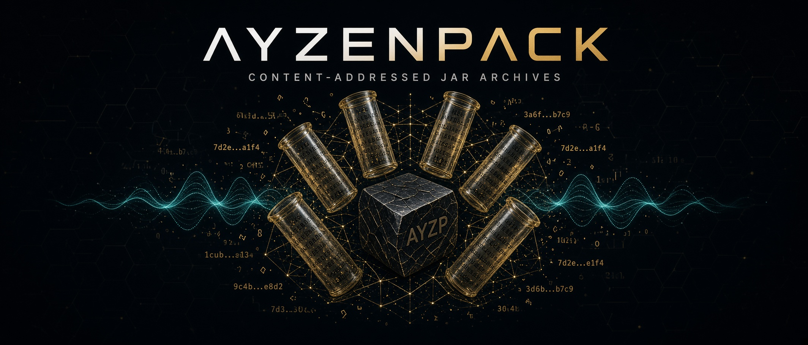

<p align="center">
  
</p>

<p align="center">
  <strong>ayzenpack</strong><br>
  Pack many JARs into one BLAKE3 + zstd archive. Restore them later.<br>
  Magic <code>AYZP</code> · extension <code>.ayz</code>
</p>

<p align="center">
  <a href="https://github.com/hilather/ayzenpack/actions/workflows/ci.yml"></a>
  <a href="LICENSE-APACHE"></a>
  
  
</p>

A fat classpath repeats Guava, Jackson, Netty, Log4j — the same class bytes, over and over, inside every JAR. `tar` does not notice. Exploding to a class forest is slow and throws away ZIP metadata.

ayzenpack **dehydrates** a set of JAR/ZIP/WAR/EAR files into one `.ayz`: each unique uncompressed entry stored once, addressed by BLAKE3, wrapped in record-aligned zstd frames (format v2), with a JSON manifest that knows how to put the JARs back together. **Rehydrate** writes the JARs out again. v1 archives still open.

```text
ayzenpack dehydrate -o libs.ayz app.jar lib/*.jar
ayzenpack rehydrate -i libs.ayz -d restored/

ayzenpack dehydrate --restore-paths -o all.ayz /abs/a.jar /abs/b.jar
ayzenpack rehydrate --restore-paths -i all.ayz
```

Aliases: `pack` = `dehydrate`, `unpack` = `rehydrate`. Also `list` and `verify`.

```text
ayzenpack pack -o libs.ayz --sort-inputs --recursive vendor/
ayzenpack unpack -i libs.ayz -d restored/ --overwrite
ayzenpack list -i libs.ayz
ayzenpack verify -i libs.ayz
```

```text
ayzenpack: 12 jars, 8401 entries, 912 unique blobs, 148.2 MiB → 41.7 MiB unique, zstd 18.4 MiB (0.124 of jar bytes)
```

Progress and that stats line go to **stderr**. stdout stays quiet on success, so the binary is pipe-safe. `-q` silences progress. `--json-logs` writes one JSON object per event on stderr.

---

## Install

Rust **1.80** or later.

```text
cargo install --path .
```

### Rocky Linux packages

Release tags `v*` run [Packages](.github/workflows/packages.yml) and attach **Rocky Linux 8 and Rocky Linux 9** RPMs plus tarballs (cosign keyless signatures included).

```text
sudo dnf install ./ayzenpack-*.x86_64.rpm
# or
tar -xzf ayzenpack-*-rocky-8-x86_64.tar.gz
sudo install -m 755 ayzenpack /usr/local/bin/
```

On a Rocky/RHEL host with gcc + rustc:

```text
PACKAGE_FAMILY=rpm DISTRO_LABEL=rocky-8 ./packaging/build-native-packages.sh
```

---

## Quick start — CLI

```text
# Deterministic pack of a vendor tree. Overwrites -o if it exists.
ayzenpack dehydrate -o libs.ayz --sort-inputs --recursive --jobs 0 \
  --exclude '*.sources.jar' --exclude '*.javadoc.jar' vendor/

ayzenpack verify -i libs.ayz
ayzenpack list -i libs.ayz
ayzenpack rehydrate -i libs.ayz -d restored/ --overwrite
```

`--jobs 0` hashes on every core; BLOB order stays first-seen, so `--sort-inputs` archives are byte-identical at any job count. Directories are not walked unless `--recursive`. Duplicate basenames become `a.jar`, `a__2.jar`, `a__3.jar`.

---

## Quick start — library

The crate is a library. The CLI is a thin clap wrapper around `dehydrate`, `rehydrate`, `list`, and `verify`.

```rust
use std::path::PathBuf;
use ayzenpack::{dehydrate, rehydrate, verify, DehydrateOptions, RehydrateOptions};

fn pack_classpath() -> ayzenpack::Result<()> {
    let summary = dehydrate(&DehydrateOptions {
        output: PathBuf::from("libs.ayz"),
        inputs: vec![PathBuf::from("app.jar"), PathBuf::from("lib")],
        recursive: true,
        sort_inputs: true,
        jobs: 0,                 // available parallelism
        fail_on_signed: true,    // abort instead of warning
        exclude: vec!["*.sources.jar".into()],
        ..DehydrateOptions::default()
    })?;
    eprintln!("unique blobs: {}", summary.unique_blob_count);

    verify("libs.ayz".as_ref())?;
    rehydrate(&RehydrateOptions {
        input: PathBuf::from("libs.ayz"),
        dir: PathBuf::from("restored"),
        overwrite: true,
        ..RehydrateOptions::default()
    })
}
```

`list(path)` returns the embedded [`Manifest`](schemas/manifest.v1.schema.json) — that is the archive catalog, not a sidecar you have to keep in sync.

Full options, YAML job files, and GitHub Actions: **[docs/library.md](docs/library.md)**.

---

## YAML job state

The crate does not parse YAML itself. Load a job file with `serde_yaml`, map it onto `DehydrateOptions` / `RehydrateOptions`, then call the library. A starter file lives at [`examples/ayzenpack.yaml`](examples/ayzenpack.yaml):

```yaml
format: ayzenpack-job
version: 1

dehydrate:
  output: dist/libs.ayz
  inputs: [app.jar, lib]
  recursive: true
  sort_inputs: true
  level: 3
  jobs: 0
  fail_on_signed: true
  exclude:
    - "*.sources.jar"
    - "*.javadoc.jar"
  write_sidecar_manifest: dist/libs.ayz.manifest.json
  pretty_manifest: true

rehydrate:
  input: dist/libs.ayz
  dir: restored
  overwrite: true
```

See [docs/library.md](docs/library.md#load-a-yaml-job-file) for the loader.

---

## Reconstruction

**Storage efficiency is of the utmost importance.** New packs store **one** CAS blob per unique uncompressed entry (BLAKE3 of those bytes) and a ZIP-slot **index** (name, CD order, method, CRC, sizes, local header / descriptor / pad, tail, prefix, blob hash). Format v2 zstd-compresses those uncompressed blobs in 4 MiB record-aligned groups. The original already-deflated ZIP payload must **not** be stored a second time. Crate **0.2.1** never writes `cdata_blob` (file or dir, any method). 0.2.0 MixedExact leftover still reads.

Rehydrate rebuilds a **valid ZIP** from index + blobs: STORE splice, a `cdata_codec` hit (`deflate-raw:flate2:*`, `deflate-raw:zlib:{1,6,9}`, or `deflate-raw:stored`) if one happened at pack time, a depth-1 child `zip_index`, or otherwise a rebuild (new compressed sizes). Whole-file `source_*` hashes may change. That is acceptable. Do not store `cdata_blob` or `raw_zip` a healthy jar to keep hashes. Spring Boot fully-executable JARs keep `[official launch.script][zip]`.

0.1.6–0.1.8 packs that still have `cdata_blob` still read. New packs must not write that shape. A listed jar (`entries[]` populated) is never stored as `raw_zip_blob`: rebuild from index + CAS, or skip-exact `write_jar`. `raw_zip` only if listing never produced `entries[]`. Crate **0.2.2** never writes `raw_zip` of a listed jar. Crate **0.2.3** rejects a `ZipArchive` that latched onto a STORE nested EOCD.

**Old archives** (0.1.4 / 0.1.5, no `tail` / `raw_zip` fields) still rehydrate via `ZipWriter`: uncompressed bytes, names, CD order, and CRC match; the deflate bitstream and extras do not. `--verbatim` is **not** a CLI flag.

Spring Boot launchers (including after `zip -A` and Zip64) keep the existing prefix detection. Nested `BOOT-INF/lib/*.jar` entries are not exploded.

Skip-exact / content-mode `ZipWriter` STOREs directories, `--store-all`, `method_code == 0`, and `zip_index`; method-8 files DEFLATE at `deflate_level`. Payload is uncompressed (`reconstruct_child_zip` for nested STORE libs). `source_*` may change.

Agent rules: [`AGENTS.md`](AGENTS.md). Design: [`DESIGN.md`](DESIGN.md).

---

## Signed JARs

STORE / codec-hit / legacy-`cdata_blob` splice keeps `META-INF/*.SF` / `*.RSA` / `*.DSA` / `*.EC` bytes, so those signatures can still verify. Rebuild changes compressed sizes and will break them. That is acceptable — do not store a second payload copy to keep a signature. ayzenpack does not re-sign.

`dehydrate` notes signed JARs and still packs. Pass `--fail-on-signed` to abort instead. `--strict` does not promote the signed notice by itself. Content-mode rebuild of an old archive can still break a signature.

---

## Archive

One file. Uncompressed header (`AYZP` + version 2), record-aligned zstd BLOB groups (flush at 4 MiB uncompressed BLOB record bytes), a final zstd frame of MANIFEST + END, uncompressed TOC (`AYZPTOC2`), uncompressed 64-byte trailer (`AYZPTLR1`, `toc_len` in bytes 56–63). v1 is one zstd frame and `toc_len = 0`.

```
┌──────────────────────────────┐
│  FileHeader  AYZP v2  JSON   │  uncompressed
├──────────────────────────────┤
│  zstd BLOB frames            │  grouped, not per-blob
├──────────────────────────────┤
│  zstd MANIFEST + END         │  last frame
├──────────────────────────────┤
│  TOC  AYZPTOC2               │  uncompressed
├──────────────────────────────┤
│  Trailer  AYZPTLR1  64 B     │  uncompressed
└──────────────────────────────┘
```

Dedup key is **BLAKE3** of uncompressed entry bytes. SHA-256 of the same bytes is recorded for integrity, never used as the CAS key. Nested JARs are opaque blobs; they are not exploded.

The MANIFEST is compact JSON with `"format": "ayzenpack-manifest"`. Field names in [`schemas/manifest.v1.schema.json`](schemas/manifest.v1.schema.json) and [`examples/tiny.manifest.json`](examples/tiny.manifest.json) are the v1 contract.

Layout, hashing, and the memory model: **[DESIGN.md](DESIGN.md)**.

---

## Commands

Global flags: `-q` / `--quiet`, `-v` / `--verbose`, `--json-logs`.

### dehydrate / pack

```text
ayzenpack dehydrate -o <OUT> [OPTIONS] <INPUTS>...
```

| Flag | Meaning |
|------|---------|
| `-o, --output` | required output path (typically `*.ayz`). Overwrites if it exists. |
| `-r, --recursive` | if an input is a directory, add `*.jar,*.zip,*.war,*.ear` (case-insensitive) |
| `--sort-inputs` | sort input paths; `created_unix` forced to `0` for deterministic archives |
| `--level <1-19>` | zstd level, default **3** |
| `--strict` | warnings → errors (does not promote the signed-JAR notice) |
| `--fail-on-signed` | error if a JAR looks signed |
| `--dry-run` | stats only; write nothing |
| `--exclude <GLOB>` | repeatable; matches CLI path or basename (`*` does not cross `/`) |
| `--jobs <N>` | hash workers; default **1**. `0` = available parallelism |
| `--max-inflight-bytes` | cap on uncompressed entry buffers in the hash pipeline, default **64 MiB** |
| `--write-sidecar-manifest <PATH>` | extra JSON file (compact unless `--pretty-manifest`) |
| `--restore-paths` | record absolute path + mode (+ uid/gid on Unix) on each jar |

`--jobs` hashes in parallel; BLOB records stay in first-seen (scan) order so `--sort-inputs` archives are byte-identical at any `--jobs`.

Shell-expanded globs are the caller’s job.

### rehydrate / unpack

```text
ayzenpack rehydrate -i <ARCHIVE> -d <DIR> [OPTIONS]
ayzenpack rehydrate --restore-paths -i <ARCHIVE>
```

| Flag | Meaning |
|------|---------|
| `-i, --input` | required `.ayz` |
| `-d, --dir` | output directory (created). Required unless `--restore-paths` |
| `--restore-paths` | write each jar to its recorded path (sibling tmp then replace; `--dir` unused) |
| `--store-all` | write ZIP entries stored (no deflate) |
| `--overwrite` | default: fail if the target JAR exists (ignored with `--restore-paths`) |
| `--only <NAME>` | repeatable; only those jar `name`s |
| `--cas-dir <PATH>` | blob spill directory; default is a tempdir deleted on success |
| `--keep-cas` | keep the CAS directory |

### list and verify

```text
ayzenpack list -i libs.ayz
ayzenpack list -i libs.ayz --json
ayzenpack verify -i libs.ayz
```

`list` prints a table (name, entries, signed, size). `--json` prints the full pretty MANIFEST on stdout.

`verify` re-hashes blobs and checks the manifest. Integrity mismatches exit **3**; unreadable / not-an-archive errors exit **1**.

---

## License

Licensed under either of

- Apache License, Version 2.0 ([LICENSE-APACHE](LICENSE-APACHE))
- MIT license ([LICENSE-MIT](LICENSE-MIT))

at your option. Dual license: **MIT OR Apache-2.0**.
